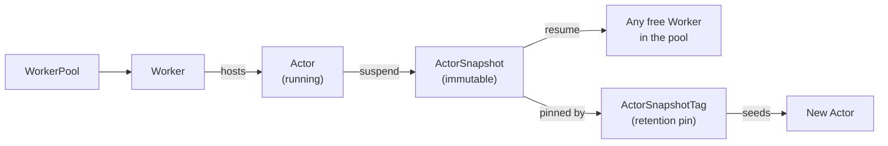

```mermaid
flowchart LR
    pool["WorkerPool"] --> worker1["Worker"]
    worker1 -->|hosts| actor["Actor<br>(running)"]
    actor -->|suspend| snapshot["ActorSnapshot<br>(immutable)"]
    snapshot -->|resume| worker2["Any free Worker<br>in the pool"]
    snapshot -->|pinned by| tag["ActorSnapshotTag<br>(retention pin)"]
    tag -->|seeds| newactor["New Actor"]
```
