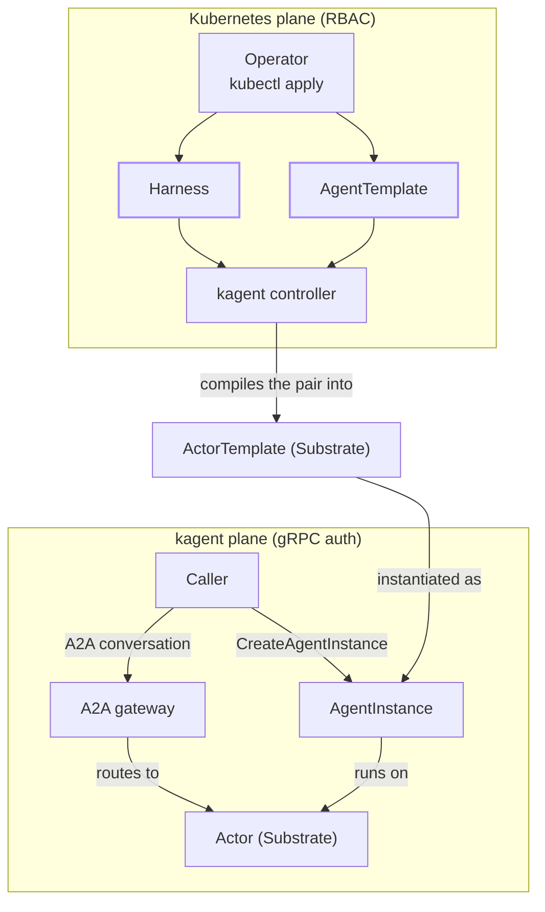

The previous page defined the [core concepts]() of Harness, AgentTemplate, AgentInstance, and Actor. This page connects them into one system: how applying a Harness and AgentTemplate leads to a running conversation, and which parts of that path Kubernetes governs versus which parts kagent governs itself.

## Two authorization planes

kagent 1.0 splits authorization across two planes:

- The **Kubernetes plane** governs the Harness and AgentTemplate custom resources. Kubernetes Role-Based Access Control (RBAC) decides who can create, read, or edit the resources with `kubectl`, exactly as it would for any other Custom Resource Definition (CRD).
- The **kagent plane** governs any interactions involving AgentInstances, such as creating, suspending, resuming, sharing, deleting, and holding a conversation with an AgentInstance. kagent's own gRPC authentication and authorization decide who can complete these interactions, independent of Kubernetes RBAC.

Someone with Kubernetes RBAC access to apply a Harness and AgentTemplate does not automatically have access to create or talk to AgentInstances that use them. The planes are not mirror images, though. kagent's gRPC API also writes Harness and AgentTemplate resources, so a caller on the kagent plane reaches both. For more information on that second path, see [Identity]().

The following diagram shows where the boundary between the two planes falls.
  

Follow the **Kubernetes plane** first. An operator applies a Harness and an AgentTemplate with `kubectl`, governed by Kubernetes RBAC. The diagram shows this path because RBAC governs it, and kagent's gRPC API reaches the same two resources instead. The kagent controller watches for a valid pair with a matching `allowedAgentTemplates` selector, and compiles it into an ActorTemplate on Substrate. The ActorTemplate sits outside both planes in the diagram because that is where it sits in reality: it is a Substrate resource that the controller creates over gRPC, not a Kubernetes object, so no Kubernetes role grants access to it.

The **kagent plane** starts once that ActorTemplate exists. A caller, who may or may not be the same person as the operator, calls `CreateAgentInstance` through kagent's gRPC API. This call is governed by kagent's own authentication and authorization, not by Kubernetes RBAC. kagent creates the AgentInstance from the newest ActorTemplate that compiled successfully, and that AgentInstance runs on an Actor.

From there, the caller holds a conversation with the AgentInstance over the A2A (Agent-to-Agent) protocol. The A2A gateway routes each request to the Actor running behind the target AgentInstance. This means that the caller only ever needs to know an AgentInstance's identity, never which Actor or Worker is behind it.

## Why two planes

Kubernetes RBAC is designed to authorize configuration changes: who can create a Deployment, edit a ConfigMap, or in this case, apply a Harness or AgentTemplate. It is not designed to authorize a running conversation, share access to it with another user, or scope who can suspend it. kagent's gRPC plane exists to authorize exactly those actions, at the granularity of a single AgentInstance rather than a namespace or a resource kind.

This split also keeps the two lifecycles independent. Editing a Harness or AgentTemplate does not affect AgentInstances already running against the ActorTemplate that they were created from. It only affects new AgentInstances, created after the edit is compiled.
