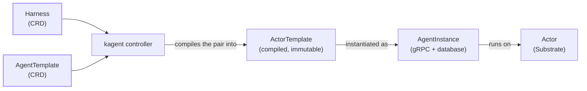

## kagent 1.0

kagent 1.0 replaces the Deployment-based `Agent` custom resource with a new model built around **Harness**, **AgentTemplate**, and **AgentInstance**, running on [Agent Substrate]() instead of the plain Kubernetes Deployments that the 0.x model uses. This page defines the vocabulary that the rest of the 1.0 model docs use. If you already have a 0.x installation, see [Upgrade from 0.x](), which maps each 0.x resource onto its 1.0 replacement.

The new model separates what an agent can do from how it is allowed to run:

- A [**Harness**](#harness) defines how an agent is allowed to run. It picks a runtime and the infrastructure policy around it.
- An [**AgentTemplate**](#agenttemplate) defines what an agent can do: its model, prompt, and tools.
- An [**AgentInstance**](#agentinstance) is a running conversation, created by pairing the two.
- An [**Actor**](#actor) is the sandboxed process, provided by Substrate, that an AgentInstance runs on.

The following diagram shows how a Harness and an AgentTemplate become a running conversation. The kagent controller compiles the Harness and AgentTemplate pair into an ActorTemplate, and each AgentInstance is created from that ActorTemplate and runs on an Actor.
  

The Harness and AgentTemplate are the only two resources that an operator applies directly. The kagent controller watches for a valid pair and compiles it into an ActorTemplate. From there, each AgentInstance created from that ActorTemplate gets its own Actor to run on.

## Harness

A **Harness** is a Kubernetes custom resource that defines _how an agent is allowed to run_. It specifies:

- **Runtime**: The engine that executes the agent. A Harness selects exactly one of `kagent`, `codex`, `claude`, or `byo`, and kagent compiles all four. `kagent` runs kagent's own Go and Python engines, `codex` and `claude` run those coding agents, and `byo` runs any image that implements kagent's A2A contract.
- **Workload**: The container image and environment the runtime runs in.
- **Substrate policy**: The [WorkerPool]() that the Harness's Actors are scheduled onto, and where their snapshots are stored.
- **Allowed AgentTemplates**: A selector that names which AgentTemplates are permitted to run on this Harness.

That last point is a one-way match, not a mutual handshake. An AgentTemplate has no field naming a Harness. Instead, a Harness's `allowedAgentTemplates` selector matches on labels, and any AgentTemplate in the same namespace carrying a matching label becomes eligible to run on it. Whoever controls a Harness's selector decides which AgentTemplates it accepts.

> [!NOTE]
> Each runtime accepts a different subset of configuration. The `codex` and `claude` runtimes support fewer model providers than `kagent` does, and neither accepts a ModelConfig that sets `defaultHeaders`, `tls`, or `apiKeyPassthrough`. A Harness and AgentTemplate pair that asks for something its runtime cannot do reports the `Compatible` condition as `False`, with the reason `UnsupportedConfiguration` and a message naming the specific setting.

A `byo` Harness has one extra requirement: it must set `spec.workload.command`, because kagent has no default entrypoint for an image that it does not build.

A Harness owns no running compute by itself. Applying one registers a runtime and policy that an AgentTemplate can pair with.

For the complete Harness schema, see the [API reference]().

> [!IMPORTANT]
> This `Harness` is unrelated to 0.x's `AgentHarness` resource, which provisions OpenClaw or Hermes coding-agent sandboxes. `Harness` is a different resource that covers how any agent is allowed to run, not a renamed or expanded version of `AgentHarness`.

## AgentTemplate

An **AgentTemplate** is a Kubernetes custom resource that defines _what an agent does_. It specifies:

- **Model configuration**: The large language model (LLM) provider and model the agent uses. This is the only field an AgentTemplate strictly requires.
- **System prompt**: A literal prompt, or a Go-templated one that can `include` shared ConfigMaps.
- **Tools**: A list of tool bindings that the agent can call. Each binding is either a Model Context Protocol (MCP) server, or another AgentTemplate used as an agent tool (see [Agent tools](#agent-tools-shared-vs-dedicated)).
- **Skills** and **plugins**: Reusable capability packages, sourced from an Open Container Initiative (OCI) registry, Git, or S3.

An AgentTemplate does nothing on its own. It becomes runnable once it is paired with a Harness whose `allowedAgentTemplates` selector accepts it.

For the complete AgentTemplate schema, see the [API reference]().

## AgentInstance

An **AgentInstance** is a _running, conversational pairing_ of a Harness and an AgentTemplate. Unlike Harness and AgentTemplate, an AgentInstance is not a Kubernetes custom resource, and does not live in etcd. kagent's own gRPC API creates it, and kagent's PostgreSQL database tracks it.

This split is deliberate, not an implementation detail to work around:

- Applying a Harness or AgentTemplate is a **Kubernetes-native operation**, governed by Kubernetes RBAC, exactly like any other CRD.
- Creating, suspending, resuming, sharing, or deleting an AgentInstance, and holding a conversation with it, are **kagent-native operations**, governed by kagent's own gRPC authentication and authorization, independent of who can `kubectl apply` a Harness or AgentTemplate.

Under the hood, the kagent controller watches for valid Harness and AgentTemplate pairs and compiles each pair into an `ActorTemplate`, a Substrate resource that holds everything Substrate needs to start an Actor.

Each compile produces one **revision**, identified by a digest: a SHA-256 hash of the compiled configuration. Because that digest is derived from the configuration itself, editing a Harness or AgentTemplate compiles to a different digest, and therefore becomes a separate ActorTemplate. kagent never rewrites an existing one.

That immutability keeps running conversations stable. When you create an AgentInstance, kagent looks up the newest revision that compiled successfully for that Harness and AgentTemplate pair, and then creates an Actor from that revision. Editing the Harness or AgentTemplate afterward does not disturb that AgentInstance, which keeps running on the revision that it was created from. Only AgentInstances created after the edit use the new revision.

Once created, an AgentInstance talks to callers over the A2A (Agent-to-Agent) protocol, through kagent's A2A gateway. The gateway resolves each request to the right AgentInstance and forwards it to the Actor running behind it.

For the AgentInstance gRPC service definition, see the [API reference]().

## Actor

An **Actor** is the sandboxed unit of compute, provided by [Agent Substrate](), that _runs an AgentInstance's conversation loop_. Every AgentInstance is backed by an Actor.

Actors are the reason why AgentInstances can suspend and resume cheaply instead of staying resident. An idle Actor can be snapshotted and torn down, then resumed from that snapshot on demand. To understand the full mechanics (Workers, WorkerPools, ActorTemplates, and snapshotting), see [Agent Substrate architecture]().

## Agent tools: Shared vs. Dedicated

An AgentTemplate's tools are not limited to MCP servers. A tool binding can also point at another AgentTemplate, letting one agent call another agent as a tool. Each agent-tool binding picks an isolation mode:

- **Shared** (default): The child agent runs inside the same Actor as its parent. This option is cheaper, but the child shares its parent's fate: if the parent's Actor is suspended or crashes, so does the child.
- **Dedicated**: The child agent gets its own Actor, isolated from its parent. This option is more expensive, but a crash or a long-running task in the child cannot take down the parent, and the child can be scaled, suspended, or resumed independently.

Shared nesting never goes more than one level deep. A Shared agent tool can have Dedicated agent tools beneath it, but it cannot contain another Shared one.

This limit keeps the model predictable. A Dedicated binding gives the child its own Actor. A Shared binding puts the child in its parent's Actor, and because Shared bindings cannot chain, that parent always has an Actor of its own. Working out where any agent runs is therefore never more than a single step.
