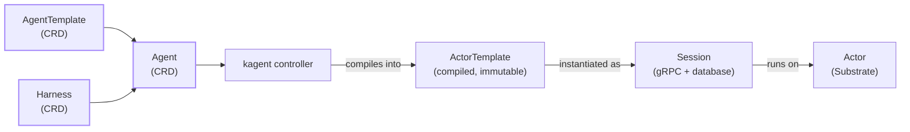

## kagent 1.0

 1.0 replaces 0.x's Deployment-based `Agent` custom resource with a new model built around **Harness**, **AgentTemplate**, **Agent**, and **Session**, running on [Agent Substrate]() instead of the plain Kubernetes Deployments that the 0.x model uses. The 1.0 `Agent` kind shares the 0.x name but not its meaning: it pairs an AgentTemplate with a Harness rather than describing a Deployment. This page defines the vocabulary that the rest of the 1.0 model docs use. If you already have a 0.x installation, you migrate to the new model rather than upgrading into it. No controller converts a 0.x resource, and the two API groups share no conversion, so you author the 1.0 resources yourself and retire the 0.x ones. [Migrate from 0.x]() maps each 0.x resource onto its 1.0 replacement.

The new model separates what an agent can do from how it is allowed to run, and then names the pairing explicitly:

- A [**Harness**](#harness) defines how an agent is allowed to run. It picks a runtime and the infrastructure policy around it.
- An [**AgentTemplate**](#agenttemplate) defines what an agent can do: its model, prompt, and tools.
- An [**Agent**](#agent) pairs one AgentTemplate with one Harness. Callers address the Agent, and the controller compiles it.
- A [**Session**](#session) is a running conversation with an Agent.
- An [**Actor**](#actor) is the sandboxed process, provided by Substrate, that a Session runs on.

The following diagram shows how an Agent becomes a running conversation. The kagent controller compiles each Agent into an ActorTemplate, and each Session is created from that ActorTemplate and runs on an Actor.
</br></br>


```mermaid
flowchart LR
    template["AgentTemplate<br>(CRD)"]
    harness["Harness<br>(CRD)"]
    agent["Agent<br>(CRD)"]
    controller["kagent controller"]
    actortemplate["ActorTemplate<br>(compiled, immutable)"]
    session["Session<br>(gRPC + database)"]
    actor["Actor<br>(Substrate)"]

    template --> agent
    harness --> agent
    agent --> controller
    controller -->|compiles into| actortemplate
    actortemplate -->|instantiated as| session
    session -->|runs on| actor

    classDef crd stroke:#a78bfa,stroke-width:2px
    class template,harness,agent crd
```

An operator applies the three custom resources directly. The kagent controller watches each Agent, resolves the template and harness that it names, and compiles the result into an ActorTemplate. From there, each Session created against that Agent gets its own Actor to run on.

> [!IMPORTANT]
> All three resources belong to the `api.kagent.dev` API group, which keeps them separate from the `kagent.dev` resources that 0.x serves, including 0.x's own `Agent` kind. The two groups share no conversion. On a cluster that serves both, qualify the resource name as `kubectl get agents.api.kagent.dev` to select the 1.0 API.

## Harness

An agent harness is the application layer that executes an agent and adds capabilities around its model. It typically assembles context, invokes the model, executes tool calls, loads skills, feeds results back into the agent loop, and manages session state. A harness can also provide memory, subagents, permissions, approvals, sandboxing, and event streaming.

Examples include [Claude Code](https://code.claude.com/docs/en/how-claude-code-works), [Codex CLI](https://learn.chatgpt.com/docs/codex/cli), [Gemini CLI](https://geminicli.com/docs/), [OpenClaw](https://docs.openclaw.ai/concepts/agent-runtimes), and custom in-house applications. Each of those runs on a local machine with your own shell and files.

A **Harness** in kagent is a Kubernetes custom resource that applies that idea to a cluster. It defines _how an agent is allowed to run_, and specifies:

- **Runtime**: The engine that executes the agent. A Harness selects exactly one of `kagent`, `codex`, `claude`, or `byo`, and kagent compiles all four. `kagent` runs kagent's own Go and Python engines, `codex` and `claude` run those coding agents, and `byo` runs any image that implements kagent's A2A contract.
- **Workload**: The container image, command, and arguments that the runtime runs as.
- **Environment**: Literal environment values for the runtime, set in `spec.env`.
- **Substrate policy**: The capacity that the agent runs on, and where its state is kept when it goes idle. Agents do not run as Deployments. [Agent Substrate](), which is the compute layer underneath kagent, runs each conversation as a sandboxed process on pre-started capacity called a [WorkerPool](). A snapshot is the saved state of one of those sandboxed processes. A snapshot is written when the conversation goes idle so that its capacity returns to the pool, and read back when the next message arrives. The Harness names the WorkerPool to schedule onto and where those snapshots are stored.

A Harness names no AgentTemplate, and an AgentTemplate names no Harness. An [Agent](#agent) pairs the two, and nothing pairs them implicitly.

Each runtime accepts a different subset of configuration, and an Agent that asks for something its runtime cannot do reports a compatibility condition rather than running. For the per-runtime restrictions and the condition that reports them, see the [API reference]().

A Harness owns no running compute by itself. Applying one registers a runtime and policy that an Agent can select.

For the complete Harness schema, see the [API reference]().

> [!IMPORTANT]
> This `Harness` is unrelated to 0.x's `AgentHarness` resource, which provisions OpenClaw or Hermes coding-agent sandboxes. `Harness` is a different resource that covers how any agent is allowed to run, not a renamed or expanded version of `AgentHarness`.

## AgentTemplate

An **AgentTemplate** is a Kubernetes custom resource that defines _what an agent does_. It specifies:

- **Model configuration**: The large language model (LLM) provider and model the agent uses.
- **System prompt**: A literal prompt, or a Go-templated one that can include shared ConfigMaps.
- **Tools**: A list of tool bindings that the agent can call. Each binding is either a Model Context Protocol (MCP) server, or another AgentTemplate used as a subagent tool (see [Subagent tools](#subagent-tools)).
- **Skills** and **plugins**: Reusable capability packages, sourced from an Open Container Initiative (OCI) registry, Git, or S3.

An AgentTemplate does nothing on its own. It becomes runnable once an Agent pairs it with a Harness. One AgentTemplate can serve many Agents, so expect fewer templates than Agents where several runtimes run the same behavior.

For the complete AgentTemplate schema, see the [API reference]().

## Agent

An **Agent** is a Kubernetes custom resource that pairs _one AgentTemplate with one Harness_. The pairing is explicit: each side takes either a reference to an existing resource or a complete inline spec, and exactly one of the two per side.

| Field | What it selects |
| ----- | --------------- |
| `spec.templateRef` | An existing AgentTemplate in the Agent's namespace, by name |
| `spec.template` | A complete AgentTemplate spec, written inline |
| `spec.harnessRef` | An existing Harness in the Agent's namespace, by name |
| `spec.harness` | A complete Harness spec, written inline |

The template side and the harness side are set independently, so an Agent can reference both, inline both, or mix the two. An inline spec is a complete value rather than an override of a referenced one, and kagent creates no Kubernetes object to back it. Every reference, including one that is nested inside an inline spec, resolves in the Agent's own namespace.

The following Agent resource references both sides:

```yaml
apiVersion: api.kagent.dev/v1alpha3
kind: Agent
metadata:
  name: assistant
  namespace: kagent
spec:
  templateRef:
    name: shared-context
  harnessRef:
    name: kagent
```

The Agent owns readiness. Its status carries the desired revision, the latest revision that compiled and prepared successfully, any non-blocking compatibility warnings, and the `Accepted`, `ResolvedRefs`, `Compatible`, and `Ready` conditions. An AgentTemplate and a Harness are shared configuration and carry no runtime status of their own.

Deleting an Agent retires its definition. Existing Sessions keep the revisions that they pinned. Recreating an Agent under the same name creates a new identity, which cannot inherit the deleted Agent's last successful revision.

For the complete Agent schema, see the [API reference]().

## Session

A **Session** is a _running conversation with one Agent_. Unlike the Harness, AgentTemplate, and Agent that it is built from, a Session is not a Kubernetes custom resource and does not live in etcd. kagent's own gRPC API creates it, and kagent's PostgreSQL database tracks it.



Each compile produces one **revision**, identified by a digest, which is a SHA-256 hash of the compiled configuration. Because that digest is derived from the configuration itself, editing an Agent or either resource it references compiles to a different digest, and therefore becomes a separate ActorTemplate. kagent never rewrites an existing one.

That immutability keeps running conversations stable. When you create a Session, kagent looks up the Agent's latest successful revision and creates an Actor from it. Editing the Agent afterward does not disturb that Session, which keeps running on the revision that it was created from. Only Sessions created after the edit use the new revision.

You can create a Session with the following command:

```bash
kagent agent session create --agent assistant -n kagent
```

After it is created, a Session talks to callers over the A2A (Agent-to-Agent) protocol, through kagent's A2A gateway. Callers address the Agent rather than the Session. The HTTP endpoint is `/agents/{namespace}/{name}` and gRPC carries the same `namespace/name` in the standard A2A `tenant` field. The Session's ID is the A2A `contextId`, so a message that carries no context identifier starts a new conversation, and a message that repeats one continues that conversation.

A Session that records no task activity for seven days is deleted by an expiration worker. The `controller.sessionIdleTTL` Helm value sets that window. A value of `0` turns the expiration worker off. For more information about what the deletion retains, see [Expire idle conversations]().

## Actor

An **Actor** is the sandboxed unit of compute, provided by [Agent Substrate](), that _runs a Session's conversation loop_. Every Session is backed by an Actor.

Actors are the reason why Sessions can suspend and resume cheaply instead of staying resident. An idle Actor can be snapshotted and torn down, then resumed from that snapshot on demand. To understand the full mechanics (Workers, WorkerPools, ActorTemplates, and snapshotting), see [Agent Substrate architecture]().

## Subagent tools

An agent tool binding can point at another AgentTemplate instead of an MCP server. In this way, a broad-scope agent can hand part of a task to one that is built specifically for that subtask. For example, a release agent delegates a database question to another agent, gets the answer, and carries on. The specialist agent keeps its own prompt and its own tools, and the conversation stays with the broader agent that the caller originally addressed.

Each subagent binding sets `tools[].subAgent.templateRef` to name an AgentTemplate in the same namespace. The named template compiles under the parent Agent's Harness and runs inside the parent's Actor, so the two agents share one sandbox and the nesting creates no second Actor. A subagent needs no Agent of its own and no matching Harness reference.

Because a subagent runs inside its parent's runtime boundary, the compiler constrains the shape of the resulting tree. Nesting stops at one level. A bound template cannot bind a third. That cap keeps the model predictable, because every agent runs either in its own Actor or in the Actor of the agent that bound it, never deeper. For the remaining rules that a tree must satisfy, see [What a subagent tree allows]().

> [!NOTE]
> Dedicated subagents, which would give a bound agent its own Harness, Session, and Actor and reach it over A2A, are not part of the served API. The `subAgent.agentRef` field that would select one is deferred until a dedicated subagent can create and invoke its own Session.
