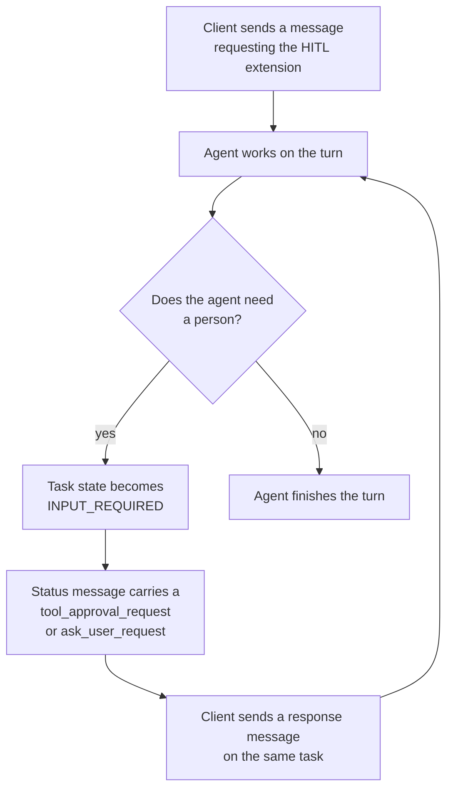

An agent that only answers questions can run unattended. An agent that takes action often should not. The human in the loop (HITL) mechanism lets an agent stop mid-turn, return a question or a pending tool call to a person, and continue once that person answers.

> [!IMPORTANT]
> HITL has two halves, and a working setup needs both. An AgentTemplate decides which tool calls pause through `requireApproval` on a tool binding. The **client** decides whether it can answer a pause by negotiating the HITL extension on each call. A client that does not request the extension still gets the pause, as the agent stops and the task waits. That client cannot answer, because the request reaches it as bare text with no correlation `id`.

## How a pause works

The following diagram traces one turn in which the agent stops for a person.



The client opens the turn by sending a message that requests the HITL extension. The agent works until it either finishes, in which case the turn ends, or needs a person. When it needs a person, the task moves to `INPUT_REQUIRED` and its status message carries either a `tool_approval_request` or an `ask_user_request`. The client answers by sending a response message on the same task, and the agent resumes the turn where it left off.

## Pause kinds

An agent pauses either to get permission before it acts or to ask a question. Each case raises its own request.

| Request | Raised when | The client answers with |
| ------- | ----------- | ----------------------- |
| `tool_approval_request` | The agent wants to call a tool from a binding that sets `requireApproval`. | `tool_approval_response` |
| `ask_user_request` | The agent calls the built-in `ask_user` tool because it needs information only a person has. | `ask_user_response` |

Both use the same pause and resume mechanism, so a client that handles one can handle the other with a different payload.

The `kagent` and `codex` runtimes both raise `ask_user_request`. The `claude` runtime does not, because the upstream Claude Code tool that backed it was removed, so a `claude` agent pauses for tool approval only.

## Require approval for a tool

An agent pauses for a tool only when its binding asks for that. Set `requireApproval` on an `mcp` tool binding in the AgentTemplate, and the agent stops before each call to a tool that the binding exposes.

```yaml
apiVersion: kagent.dev/v1alpha3
kind: AgentTemplate
metadata:
  name: cluster-operator
  namespace: kagent
  labels:
    kagent.dev/harness: kagent
spec:
  tools:
    - mcp:
        server:
          kind: RemoteMCPServer
          name: kagent-tool-server
        tools:
          - k8s_delete_resource
          - k8s_patch_resource
        requireApproval: true
```

| Field | Description |
| ----- | ----------- |
| `mcp.tools` | The names of the tools to bind. Omit the list, or leave it empty, to bind every tool that the server offers. |
| `mcp.requireApproval` | Pauses before each invocation of a tool that this binding exposes. The pause covers the tools in `mcp.tools`, or every tool on the server when `mcp.tools` is omitted or empty. Omit to run the bound tools without approval. |

For the rest of the binding's fields, see [About tools]().

Approval belongs to the binding rather than to the tool name, so one server can supply both kinds of tool. Bind the tools that need a person in a binding that sets `requireApproval`, and bind the rest in a second binding that omits it.

> [!NOTE]
> kagent 0.x named the tools that needed approval in a `requireApproval` list on the `Agent` resource, which matched tool names across every server. In 1.x, approval is a property of one binding, so the same tool name can pause for one server and run freely for another.

Two limits apply to what a binding can express, and both depend on the runtime:

| Runtime | Approval | Splitting one server across two bindings |
| ------- | -------- | ---------------------------------------- |
| `kagent` | Supported. | Supported. |
| `codex` | Supported. | Rejected, with `RemoteMCPServer "<name>" is bound more than once`. |
| `claude` | Supported. | Rejected, with `RemoteMCPServer "<name>" is bound more than once`. A binding whose tool selection kagent cannot verify against the server's discovered tools exposes the whole server and reports a warning. |

Anything the binding does not cover runs without a pause. A built-in tool, such as file access, shell, or web search, and any MCP tool on a binding that omits `requireApproval`, is approved automatically. The sandbox is the boundary that contains those calls. For more information, see [Sandboxing]().

## Negotiate the extension

HITL is an [A2A](https://a2a-protocol.org) message extension, identified by a versioned URI. A client requests it by setting that URI as the `A2A-Extensions` header on the call that sends a message.

```http
A2A-Extensions: https://kagent.dev/extensions/hitl/v1
```

kagent activates the extension only for calls that request it, and echoes the activated URI back. A client that never requests the extension sees ordinary turns until the agent needs a person. The turn then pauses like any other, and that client has no way to answer the request.

A call from outside the cluster addresses the agent with two more headers, because the gateway routes on metadata rather than on a path. Port-forward the controller's gRPC port first, as in [Install kagent]().

```bash
grpcurl -plaintext \
  -H 'A2A-Extensions: https://kagent.dev/extensions/hitl/v1' \
  -H 'x-kagent-agent-instance-id: <instance-id>' \
  -d '{
    "message": {
      "messageId": "msg-1",
      "role": "ROLE_USER",
      "parts": [{"text": "Delete the obsolete pod in the production namespace."}]
    }
  }' localhost:8083 lf.a2a.v1.A2AService/SendStreamingMessage
```

When the agent pauses, the payload arrives in the status message's `metadata`, keyed by the extension URI. The URI is also listed in the message's `extensions` array. Each payload carries a `type` field that specifies its shape.

| Type | Direction |
| ---- | --------- |
| `tool_approval_request` | Agent to client |
| `ask_user_request` | Agent to client |
| `tool_approval_response` | Client to agent |
| `ask_user_response` | Client to agent |

> [!WARNING]
> In case of failure, both halves of this negotiation fail silently, and neither failure reports anything.
- **A send that omits the header produces a pause that cannot be answered.** The turn still stops, but its status message carries the question as prose, with no `metadata` and no correlation `id`, so there is nothing to render and no `id` to answer with. Re-reading that task with the header does not recover it, because the payload was never attached. Send the header on every call: it is harmless on a read, and unrecoverable if missed on a send. An attached payload is stored with the task, so a later read returns it whether or not that read requests the extension.
- **A response that omits the `extensions` array is delivered as ordinary text.** kagent ignores the `metadata` payload unless the message itself lists the extension URI in `extensions`. The task resumes and the agent replies, so the call looks like it worked, but the structured decision never reached the agent.

### Approving or rejecting a tool

A `tool_approval_request` lists the pending calls, each with an `id`, the tool `name`, and the `args` the agent chose. The response decides every listed call.

```json
{
  "type": "tool_approval_response",
  "approvals": [
    { "id": "<tool-id>", "approved": true },
    { "id": "<other-tool-id>", "approved": false, "rejection_reason": "Deleting that namespace is out of scope." }
  ]
}
```

A response must decide every call in the request. A rejection reason is optional but worth sending, because the agent receives it and can adapt rather than simply failing.

### Answering a question

An `ask_user_request` carries an `id` and a list of `questions`. The response echoes the same `id` and answers them in order.

```json
{
  "type": "ask_user_response",
  "id": "<request-id>",
  "answers": [
    { "answer": ["us-east-1"] }
  ]
}
```

## Resume a paused task

A paused task waits. To resume, the client sends a message on the same task and context, carrying the response payload. kagent rejects a resume attempt on a task that is not waiting, with `task is not waiting for input`.

While the task waits, kagent pauses the Actor rather than suspending it. A pause keeps the running process in a full snapshot on node-local storage, so a runtime that holds a live process across the wait, such as `codex` or `claude`, continues the same turn on resume. The Worker is released in the meantime, so a conversation that sits at `INPUT_REQUIRED` costs no pool capacity. For more information on the suspend that a finished turn uses instead, see [Suspend and resume]().

Because the transcript only grows, the question and the answer both stay in the task history, so a later reader can see what was asked and what a person decided.

## Task states

An A2A task moves through several states over its life. Two of them mean that the task has stopped and is waiting on a person, rather than working.

| State | Meaning |
| ----- | ------- |
| `INPUT_REQUIRED` | The agent is waiting for a person. This is the state that a tool approval or a question produces. |
| `AUTH_REQUIRED` | The agent is waiting for credentials. kagent's own runtimes never set this state, but its gateway accepts a resume from it, so a `byo` runtime that produces it works. |

## Agents bound as tools

An agent that a parent binds as a tool can raise a pause of its own. The request then carries a `nested` block naming the subagent, along with its task and context, so a client can tell the person which agent is actually asking rather than attributing it to the parent.

## Client support

The AgentTemplate decides that a turn pauses, but the client decides whether a person can answer it. What someone can do with a pause therefore depends on which client raised the turn.

| Client | HITL |
| ------ | ---- |
| Your own A2A client | Full. Request the extension URI and handle the four payload types. |
| An MCP client that supports tasks | Supported. `invoke_agent_instance` returns a task, and input requests surface as MCP elicitations. |
| The kagent CLI | Not supported, and a turn that pauses is stranded. `kagent invoke` does not request the extension, so an agent that needs a person parks the task at `INPUT_REQUIRED` with nothing to answer it by. The CLI reports `Input required to continue this AgentInstance.` and stops there. Send the turn again from a client that requests the extension. |

## Next steps


  ` title="About tools" subtitle="Bind the tools that an approval request would cover." >}}
  ` title="System prompts" subtitle="Tell an agent when to ask rather than act." >}}

