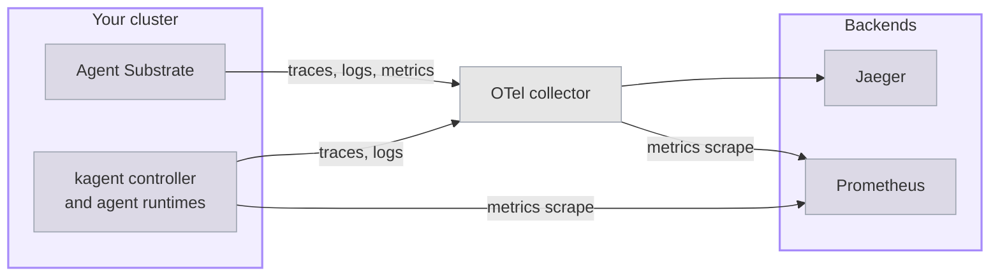

Deploy a small observability stack based on OpenTelemetry (OTel) that collects traces and metrics from both kagent and Agent Substrate. The stack includes the following components:

- **Traces**: Distributed tracing with [Jaeger](https://github.com/jaegertracing/jaeger).
- **Metrics**: Time-series metrics collection with [Prometheus](https://github.com/prometheus/prometheus).
- **Collection**: Telemetry collection and routing with the [OpenTelemetry Collector](https://github.com/open-telemetry/opentelemetry-collector).
- **Logs**: No logging backend. The collector prints the logs that it receives to its own output.

This stack follows the setup that Agent Substrate uses for its own local testing, and it needs less memory than the [OTel stack]() with Grafana.

## About the stack

The stack has no logging backend. The collector prints the logs that it receives to its own output, which is enough to confirm that logs arrive. To store and query logs, such as the Actor state changes that Agent Substrate records, use the [OTel stack](), which adds Loki.
</br></br>



For what kagent and Agent Substrate each send, see [About the stack]() in the OTel stack guide.

## Before you begin

1. [Install kagent]().
2. [Create your first agent](), so that you have a Harness and an AgentTemplate to send requests to. That guide also installs the kagent CLI. The steps on this page need the  CLI, because earlier CLI versions have no `agent-instance` commands and fail with `unknown command`. To check your version, run `kagent version`.
3. Install [`jq`](https://jqlang.org/download/), to read the AgentInstance ID and revision out of the CLI's JSON output.

## Install Jaeger

Install [Jaeger](https://www.jaegertracing.io/) in all-in-one mode, which stores traces in memory and needs no other components.

```bash
helm upgrade --install jaeger jaeger \
  --repo https://jaegertracing.github.io/helm-charts \
  --version  \
  --namespace telemetry --create-namespace \
  --values - <<EOF
provisionDataStore:
  cassandra: false
allInOne:
  enabled: true
storage:
  type: memory
agent:
  enabled: false
collector:
  enabled: false
query:
  enabled: false
EOF
```

## Install Prometheus

Install the [Prometheus](https://github.com/prometheus-community/helm-charts/tree/main/charts/prometheus) server on its own, without the exporters and Alertmanager that the chart includes by default. The values configure two scrape jobs, one for the metrics that the collector serves and one for the kagent controller.

1. Install the chart.
   ```bash
   helm upgrade --install prometheus prometheus \
     --repo https://prometheus-community.github.io/helm-charts \
     --version  \
     --namespace telemetry \
     --values - <<EOF
   alertmanager:
     enabled: false
   kube-state-metrics:
     enabled: false
   prometheus-node-exporter:
     enabled: false
   prometheus-pushgateway:
     enabled: false
   server:
     persistentVolume:
       enabled: false
   extraScrapeConfigs: |
     - job_name: otel-collector
       scrape_interval: 15s
       static_configs:
       - targets: ["otel-collector.telemetry.svc.cluster.local:8889"]
     - job_name: kagent-controller
       scrape_interval: 15s
       scheme: https
       authorization:
         credentials_file: /var/run/secrets/kubernetes.io/serviceaccount/token
       tls_config:
         insecure_skip_verify: true
       static_configs:
       - targets: ["kagent-controller-metrics.kagent.svc.cluster.local:8443"]
   EOF
   ```

   The kagent controller serves its metrics over HTTPS with a self-signed certificate, and it accepts a scrape only from a ServiceAccount that holds its metrics reader role. The `kagent-controller` job therefore skips certificate verification and sends the Prometheus ServiceAccount token.

   The `kagent-controller` target reads `DOWN` until you turn on the controller metrics in [Send kagent telemetry to the collector](#send-kagent-telemetry-to-the-collector), because the controller metrics Service does not exist before then.

2. Verify that Prometheus is running.
   ```bash
   kubectl get pods -n telemetry -l app.kubernetes.io/name=prometheus
   ```

## Install the OTel collector

Install a collector that receives OTLP on ports `4317` for gRPC and `4318` for HTTP. The collector sends traces to Jaeger, serves metrics on port `8889`, and prints logs to its own output. The configuration uses the `contrib` collector image, because the Prometheus exporter is not part of the core image.

```bash
helm upgrade --install otel-collector opentelemetry-collector \
  --repo https://open-telemetry.github.io/opentelemetry-helm-charts \
  --version  \
  --namespace telemetry \
  --values - <<EOF
fullnameOverride: otel-collector
mode: deployment
image:
  repository: otel/opentelemetry-collector-contrib
ports:
  metrics-export:
    enabled: true
    containerPort: 8889
    servicePort: 8889
    protocol: TCP
config:
  receivers:
    otlp:
      protocols:
        grpc:
          endpoint: 0.0.0.0:4317
        http:
          endpoint: 0.0.0.0:4318
  processors:
    batch: {}
  exporters:
    debug:
      verbosity: basic
    otlp_grpc/jaeger:
      endpoint: jaeger.telemetry.svc.cluster.local:4317
      tls:
        insecure: true
    prometheus:
      endpoint: 0.0.0.0:8889
      resource_to_telemetry_conversion:
        enabled: true
  service:
    pipelines:
      traces:
        receivers: [otlp]
        processors: [batch]
        exporters: [otlp_grpc/jaeger]
      logs:
        receivers: [otlp]
        processors: [batch]
        exporters: [debug]
      metrics:
        receivers: [otlp]
        processors: [batch]
        exporters: [prometheus]
EOF
```

## Send kagent telemetry to the collector

Turn on the kagent trace and log exporters, and point both at the collector. Also turn on the controller's metrics endpoint, and allow Prometheus to scrape it.

1. Save the current revision of your Harness and AgentTemplate pair. A later step uses it to tell when kagent recompiles the pair with the new settings. The command first waits for any recompile that is still in progress, such as one from an earlier Helm upgrade, so that it saves a finished revision.
   ```bash
   for i in $(seq 1 60); do
     REVISIONS=$(kubectl get agenttemplate my-first-agent -n kagent \
       -o jsonpath='{.status.harnesses[0].desiredRevision} {.status.harnesses[0].latestSuccessfulRevision}')
     [ "${REVISIONS% *}" = "${REVISIONS#* }" ] && break
     sleep 5
   done
   export OLD_REVISION=${REVISIONS#* }
   echo "Current revision: $OLD_REVISION"
   ```

2. Upgrade the kagent Helm release to export traces and logs to the collector, and to serve controller metrics.
   ```bash
   helm upgrade kagent \
     / \
     --version  \
     --namespace kagent \
     --reuse-values \
     --values - <<EOF
   otel:
     tracing:
       enabled: true
       exporter:
         otlp:
           endpoint: http://otel-collector.telemetry.svc.cluster.local:4317
           protocol: grpc
           insecure: true
     logging:
       enabled: true
       exporter:
         otlp:
           endpoint: http://otel-collector.telemetry.svc.cluster.local:4317
           protocol: grpc
           insecure: true
   controller:
     metrics:
       enabled: true
   EOF
   ```

3. Allow Prometheus to scrape the controller. Bind the metrics reader role that the kagent chart creates to the Prometheus ServiceAccount.
   ```bash
   kubectl create clusterrolebinding kagent-metrics-reader-prometheus \
     --clusterrole=kagent-metrics-reader \
     --serviceaccount=telemetry:prometheus-server
   ```

4. Wait for the controller to roll out.
   ```bash
   kubectl rollout status deployment/kagent-controller -n kagent --timeout=300s
   ```

5. Wait for kagent to recompile the pair. The controller rebuilds each pair after the controller restarts, and an AgentInstance that you create before the rebuild finishes starts from the previous revision, without the new settings. The following command prints `Recompiled` when the new revision is ready.
   ```bash
   for i in $(seq 1 60); do
     [ "$(kubectl get agenttemplate my-first-agent -n kagent \
       -o jsonpath='{.status.harnesses[0].latestSuccessfulRevision}')" != "$OLD_REVISION" ] \
       && echo "Recompiled" && break
     sleep 5
   done
   ```
   If the command finishes without printing `Recompiled`, the upgrade did not change the settings that kagent compiles into the pair. Either the settings were already in place, or the chart did not recognize the `otel` keys. Helm accepts a key that a chart does not define without an error, so check that you upgraded to version  of the chart, which uses the keys on this page.

## Send Agent Substrate telemetry to the collector

Upgrade the Agent Substrate Helm release. A single `otel.endpoint` setting turns on traces, logs, and metrics for every Agent Substrate component. Agent Substrate keeps 1% of its traces by default, so the command keeps every trace instead. Lower `samplingRatio` again for production.

```bash
helm upgrade substrate \
  oci://ghcr.io/kagent-dev/substrate/helm/substrate \
  --version  \
  --namespace ate-system \
  --reuse-values \
  --set otel.endpoint=http://otel-collector.telemetry.svc.cluster.local:4317 \
  --set otel.traces.samplingRatio=1.0 \
  --wait --timeout 10m
```

## Send a request

Create an AgentInstance that picks up the new telemetry settings, and send it a request to produce traces and metrics.

1. Create a new AgentInstance. An AgentInstance keeps the runtime configuration that it was created with, so only a new AgentInstance exports traces.
   ```bash
   kagent create agent-instance --harness my-first-harness --agent-template my-first-agent
   ```

2. Confirm that the AgentInstance runs the current revision of the pair. The command waits until kagent finishes compiling the pair, then compares that revision with the one that the AgentInstance started from. If the command prints `Outdated`, the AgentInstance was created from an earlier revision, and exports without the new settings. Create another AgentInstance, and run the command again.
   ```bash
   for i in $(seq 1 60); do
     REVISIONS=$(kubectl get agenttemplate my-first-agent -n kagent \
       -o jsonpath='{.status.harnesses[0].desiredRevision} {.status.harnesses[0].latestSuccessfulRevision}')
     [ "${REVISIONS% *}" = "${REVISIONS#* }" ] && break
     sleep 5
   done
   INSTANCE_REVISION=$(kagent get agent-instance -o json \
     | jq -r '[.agentInstances[] | select(.agentTemplate.name == "my-first-agent")] | sort_by(.createdAt) | last | .preparedRevision')
   [ "$INSTANCE_REVISION" = "${REVISIONS#* }" ] && echo "Current" || echo "Outdated"
   ```

3. Send a request to produce telemetry.
   ```bash
   export INSTANCE_ID=$(kagent get agent-instance -o json \
     | jq -r '[.agentInstances[] | select(.agentTemplate.name == "my-first-agent")] | sort_by(.createdAt) | last | .id')
   kagent invoke --agent-instance $INSTANCE_ID --task "What is 2+2?"
   ```

## Review the telemetry

Check each signal in turn: traces in Jaeger, metrics in Prometheus, and logs in the collector's own output.

1. Review the traces in Jaeger.
   1. Forward the Jaeger query port, and leave the command running.
      ```bash
      kubectl port-forward -n telemetry svc/jaeger 16686:16686
      ```
   2. In your browser, open Jaeger at [http://localhost:16686](http://localhost:16686).
   3. From the **Service** list, select `my-first-agent-my-first-harness`, and click **Find Traces**. To see Agent Substrate's own work, select one of its services instead: `ateapi`, `atenet-router`, `atelet`, `atecontroller`, or `ateom-gvisor`. For what each service reports, see [Agent Substrate traces]().

2. Review the metrics in Prometheus.
   1. Forward the Prometheus port, and leave the command running.
      ```bash
      kubectl port-forward -n telemetry svc/prometheus-server 9090:80
      ```
   2. In your browser, open Prometheus at [http://localhost:9090/targets](http://localhost:9090/targets), and confirm that the `otel-collector` and `kagent-controller` targets are `UP`.
   3. Open the **Query** page, and run a query such as `ate_workerpool_ready_workers`. For more metrics, see [Metrics]().

3. Check that the collector receives logs. Each line reports a batch of log records from one source.
   ```bash
   kubectl logs -n telemetry deploy/otel-collector | grep '"otelcol.signal": "logs"'
   ```

## Clean up

1. Turn off telemetry export in kagent and Agent Substrate.
   ```bash
   helm upgrade kagent \
     / \
     --version  \
     --namespace kagent --reuse-values \
     --set otel.tracing.enabled=false \
     --set otel.logging.enabled=false \
     --set controller.metrics.enabled=false
   helm upgrade substrate \
     oci://ghcr.io/kagent-dev/substrate/helm/substrate \
     --version  \
     --namespace ate-system --reuse-values \
     --set otel.endpoint="" \
     --set otel.traces.samplingRatio=0.01
   ```

2. Remove the role binding, the collector, the backends, and the `telemetry` namespace.
   ```bash
   kubectl delete clusterrolebinding kagent-metrics-reader-prometheus
   helm uninstall otel-collector prometheus jaeger -n telemetry
   kubectl delete namespace telemetry
   ```

## Next steps


  ` title="Tracing" subtitle="Read the spans and attributes of an agent request." >}}
  ` title="Metrics" subtitle="Review the metrics that kagent and Agent Substrate report." >}}
  ` title="OTel stack" subtitle="Add Loki and Grafana to store logs and view every signal in one place." >}}

