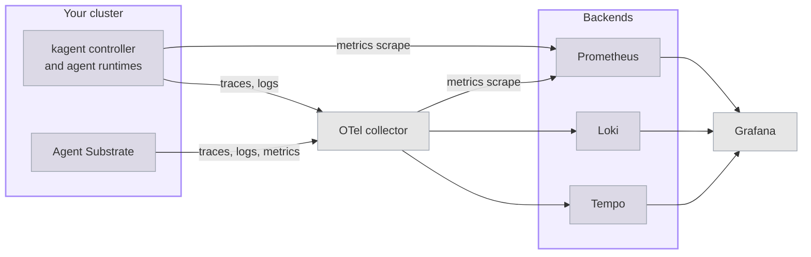

Deploy an open source observability stack based on OpenTelemetry (OTel) that collects telemetry from both kagent and Agent Substrate. The stack includes the following components:

- **Logs**: Log collection and storage with Grafana [Loki](https://github.com/grafana/loki).
- **Traces**: Distributed tracing with Grafana [Tempo](https://github.com/grafana/tempo).
- **Metrics**: Time-series metrics collection with [Prometheus](https://github.com/prometheus/prometheus).
- **Collection**: Telemetry collection and routing with the [OpenTelemetry Collector](https://github.com/open-telemetry/opentelemetry-collector).
- **Visualization**: Dashboards and queries across all three signals with [Grafana](https://github.com/grafana/grafana).

For a smaller stack with Jaeger and Prometheus only, see [Lightweight OTel stack]().

## About the stack

 and Agent Substrate each export their own telemetry over the OpenTelemetry Protocol (OTLP), and neither exports anything by default. The collector gives both a single address to send to, and holds the rules for where each signal goes next. The kagent controller also serves Prometheus metrics, which Prometheus scrapes directly.
</br></br>



The following table lists what each source sends. For the meaning of each signal, see [Tracing]() and [Metrics]().

| Source | Traces | Logs | Metrics |
| ------ | ------ | ---- | ------- |
| kagent controller and agent runtimes | One trace per agent request, across the controller, the Agent Substrate proxy, and the agent runtime. | Audit events for the prompts and replies that agents exchange with a model. | Reconciliation, work queue, and gRPC API metrics, scraped from the controller's `/metrics` endpoint. |
| Agent Substrate | Separate traces for its own work, such as routing a request to a Worker and resuming an Actor. | Actor lifecycle events and the router access log. | Actor lifecycle, scheduling, snapshot, image cache, and WorkerPool capacity metrics. |

Agent Substrate traces do not join the trace of the agent request that caused them. To see why a request was slow to start, look up the Agent Substrate trace from the same time window.

## Before you begin

1. [Install kagent]().
2. [Create your first agent](), so that you have a Harness and an AgentTemplate to send requests to.
3. Make sure that your cluster has about 1.5 GB of memory available in addition to kagent. On a kind cluster, the memory limit is the memory that you give Docker.

## Install Tempo and Loki

Install the backends that store traces and logs. Both run as a single replica without persistent storage, which suits evaluation. For production, follow the Grafana guidance for [Tempo](https://grafana.com/docs/tempo/latest/setup/helm-chart/) and [Loki](https://grafana.com/docs/loki/latest/setup/install/helm/).

1. Install Tempo, with an OTLP receiver for traces.
   ```bash
   helm upgrade --install tempo tempo \
     --repo https://grafana.github.io/helm-charts \
     --version  \
     --namespace telemetry --create-namespace \
     --values - <<EOF
   persistence:
     enabled: false
   tempo:
     receivers:
       otlp:
         protocols:
           grpc:
             endpoint: 0.0.0.0:4317
           http:
             endpoint: 0.0.0.0:4318
   EOF
   ```

2. Install Loki in single-binary mode. The values file disables the two Loki memcached caches, because the chart requests roughly 10 GB of memory for them by default and a single-node cluster cannot schedule that request.
   ```bash
   helm upgrade --install loki loki \
     --repo https://grafana.github.io/helm-charts \
     --version  \
     --namespace telemetry \
     --values - <<EOF
   loki:
     commonConfig:
       replication_factor: 1
     schemaConfig:
       configs:
         - from: 2024-04-01
           store: tsdb
           object_store: s3
           schema: v13
           index:
             prefix: loki_index_
             period: 24h
     auth_enabled: false
   singleBinary:
     replicas: 1
   minio:
     enabled: true
   gateway:
     enabled: false
   test:
     enabled: false
   monitoring:
     selfMonitoring:
       enabled: false
       grafanaAgent:
         installOperator: false
   lokiCanary:
     enabled: false
   chunksCache:
     enabled: false
   resultsCache:
     enabled: false
   limits_config:
     allow_structured_metadata: true
   memberlist:
     service:
       publishNotReadyAddresses: true
   deploymentMode: SingleBinary
   backend:
     replicas: 0
   read:
     replicas: 0
   write:
     replicas: 0
   ingester:
     replicas: 0
   querier:
     replicas: 0
   queryFrontend:
     replicas: 0
   queryScheduler:
     replicas: 0
   distributor:
     replicas: 0
   compactor:
     replicas: 0
   indexGateway:
     replicas: 0
   bloomCompactor:
     replicas: 0
   bloomGateway:
     replicas: 0
   EOF
   ```

3. Verify that the pods are running.
   ```bash
   kubectl get pods -n telemetry
   ```
   Example output:
   ```console
   NAME           READY   STATUS    RESTARTS   AGE
   loki-0         2/2     Running   0          90s
   loki-minio-0   1/1     Running   0          90s
   tempo-0        1/1     Running   0          2m
   ```

## Install Prometheus and Grafana

Install the [kube-prometheus-stack](https://github.com/prometheus-community/helm-charts/tree/main/charts/kube-prometheus-stack) chart, which includes Prometheus, the Prometheus Operator, and Grafana. The values add Tempo and Loki as Grafana data sources, and turn off Alertmanager and the node exporter to save memory.

1. Install the chart.
   ```bash
   helm upgrade --install kube-prometheus-stack kube-prometheus-stack \
     --repo https://prometheus-community.github.io/helm-charts \
     --version  \
     --namespace telemetry \
     --values - <<EOF
   alertmanager:
     enabled: false
   nodeExporter:
     enabled: false
   prometheus:
     prometheusSpec:
       serviceMonitorSelectorNilUsesHelmValues: false
       podMonitorSelectorNilUsesHelmValues: false
   grafana:
     additionalDataSources:
     - name: Tempo
       type: tempo
       uid: tempo
       url: http://tempo.telemetry.svc.cluster.local:3100
     - name: Loki
       type: loki
       uid: loki
       url: http://loki.telemetry.svc.cluster.local:3100
   EOF
   ```

   

   | Setting | Description |
   | ------- | ----------- |
   | `serviceMonitorSelectorNilUsesHelmValues` | Set to `false` so that Prometheus scrapes every ServiceMonitor in the cluster, including the ones that the kagent chart and this guide create. By default, Prometheus scrapes only the ServiceMonitors that carry the chart's release label. |
   | `additionalDataSources` | Adds Tempo and Loki to Grafana. Tempo serves its query API on port `3100` in this chart version. The chart adds Prometheus as a data source on its own. |

2. Verify that Prometheus and Grafana are running.
   ```bash
   kubectl get pods -n telemetry -l 'app.kubernetes.io/name in (prometheus,grafana)'
   ```
   Example output:
   ```console
   NAME                                             READY   STATUS    RESTARTS   AGE
   kube-prometheus-stack-grafana-7599d6f796-lb4l5   3/3     Running   0          2m
   prometheus-kube-prometheus-stack-prometheus-0    2/2     Running   0          2m
   ```

## Install the OTel collector

Install a collector that receives OTLP on ports `4317` for gRPC and `4318` for HTTP, and forwards each signal to its backend. The collector sends traces to Tempo and logs to Loki, and serves metrics on port `8889` for Prometheus to scrape. The configuration uses the `contrib` collector image, because the Prometheus exporter is not part of the core image.

1. Install the collector.
   ```bash
   helm upgrade --install otel-collector opentelemetry-collector \
     --repo https://open-telemetry.github.io/opentelemetry-helm-charts \
     --version  \
     --namespace telemetry \
     --values - <<EOF
   fullnameOverride: otel-collector
   mode: deployment
   image:
     repository: otel/opentelemetry-collector-contrib
   ports:
     metrics-export:
       enabled: true
       containerPort: 8889
       servicePort: 8889
       protocol: TCP
   config:
     receivers:
       otlp:
         protocols:
           grpc:
             endpoint: 0.0.0.0:4317
           http:
             endpoint: 0.0.0.0:4318
     processors:
       batch: {}
     exporters:
       otlp_grpc/tempo:
         endpoint: tempo.telemetry.svc.cluster.local:4317
         tls:
           insecure: true
       otlp_http/loki:
         endpoint: http://loki.telemetry.svc.cluster.local:3100/otlp
       prometheus:
         endpoint: 0.0.0.0:8889
         resource_to_telemetry_conversion:
           enabled: true
     service:
       pipelines:
         traces:
           receivers: [otlp]
           processors: [batch]
           exporters: [otlp_grpc/tempo]
         logs:
           receivers: [otlp]
           processors: [batch]
           exporters: [otlp_http/loki]
         metrics:
           receivers: [otlp]
           processors: [batch]
           exporters: [prometheus]
   EOF
   ```

   The `resource_to_telemetry_conversion` setting copies OTel resource attributes, such as the service name, onto each metric as labels. Without it, you cannot tell which Agent Substrate component reported a metric.

2. Create a ServiceMonitor so that Prometheus scrapes the metrics that the collector serves.
   ```yaml
   kubectl apply -f - <<EOF
   apiVersion: monitoring.coreos.com/v1
   kind: ServiceMonitor
   metadata:
     name: otel-collector
     namespace: telemetry
   spec:
     selector:
       matchLabels:
         app.kubernetes.io/instance: otel-collector
     endpoints:
     - port: metrics-export
       interval: 15s
   EOF
   ```

3. Verify that the collector is running.
   ```bash
   kubectl get pods -n telemetry -l app.kubernetes.io/instance=otel-collector
   ```
   Example output:
   ```console
   NAME                              READY   STATUS    RESTARTS   AGE
   otel-collector-5f774c87bc-hpzsk   1/1     Running   0          40s
   ```

## Send kagent telemetry to the collector

Turn on the kagent trace and log exporters, and point both at the collector. Also turn on the controller's metrics endpoint, together with the ServiceMonitor that the kagent chart creates for it.

1. Save the current revision of your Harness and AgentTemplate pair. A later step uses it to tell when kagent recompiles the pair with the new settings. The command first waits for any recompile that is still in progress, such as one from an earlier Helm upgrade, so that it saves a finished revision.
   ```bash
   for i in $(seq 1 60); do
     REVISIONS=$(kubectl get agenttemplate my-first-agent -n kagent \
       -o jsonpath='{.status.harnesses[0].desiredRevision} {.status.harnesses[0].latestSuccessfulRevision}')
     [ "${REVISIONS% *}" = "${REVISIONS#* }" ] && break
     sleep 5
   done
   export OLD_REVISION=${REVISIONS#* }
   echo "Current revision: $OLD_REVISION"
   ```

2. Upgrade the kagent Helm release.
   ```bash
   helm upgrade kagent \
     / \
     --version  \
     --namespace kagent \
     --reuse-values \
     --values - <<EOF
   otel:
     tracing:
       enabled: true
       exporter:
         otlp:
           endpoint: http://otel-collector.telemetry.svc.cluster.local:4317
           protocol: grpc
           insecure: true
     logging:
       enabled: true
       exporter:
         otlp:
           endpoint: http://otel-collector.telemetry.svc.cluster.local:4317
           protocol: grpc
           insecure: true
   controller:
     metrics:
       enabled: true
       serviceMonitor:
         enabled: true
         prometheusServiceAccount:
           name: kube-prometheus-stack-prometheus
           namespace: telemetry
   EOF
   ```

   

   | Setting | Description |
   | ------- | ----------- |
   | `otel.tracing` | Exports traces from the controller and from the agent runtimes that it starts. For each field, see [Tracing](). |
   | `otel.logging` | Exports audit events from the agent runtimes. By default, kagent withholds message content, so each event body reads `<elided>`. |
   | `controller.metrics.enabled` | Serves the controller's Prometheus metrics on port `8443` over HTTPS. |
   | `controller.metrics.serviceMonitor` | Creates a ServiceMonitor for the metrics endpoint. The `prometheusServiceAccount` setting binds the metrics reader role to the Prometheus ServiceAccount, which authorizes the scrape. |

3. Wait for the controller to roll out.
   ```bash
   kubectl rollout status deployment/kagent-controller -n kagent --timeout=300s
   ```

4. Wait for kagent to recompile the pair. The controller rebuilds each pair after it restarts, and an AgentInstance that you create before the rebuild finishes starts from the previous revision, without the new settings. The following command prints `Recompiled` when the new revision is ready.
   ```bash
   for i in $(seq 1 60); do
     [ "$(kubectl get agenttemplate my-first-agent -n kagent \
       -o jsonpath='{.status.harnesses[0].latestSuccessfulRevision}')" != "$OLD_REVISION" ] \
       && echo "Recompiled" && break
     sleep 5
   done
   ```
   If the command finishes without printing `Recompiled`, the upgrade did not change the pair, for example because the settings were already in place.

## Send Agent Substrate telemetry to the collector

Point Agent Substrate at the collector. A single `otel.endpoint` setting turns on traces, logs, and metrics for every Agent Substrate component.

1. Upgrade the Agent Substrate Helm release.
   ```bash
   helm upgrade substrate \
     oci://ghcr.io/kagent-dev/substrate/helm/substrate \
     --version  \
     --namespace ate-system \
     --reuse-values \
     --set otel.endpoint=http://otel-collector.telemetry.svc.cluster.local:4317 \
     --set otel.traces.samplingRatio=1.0 \
     --wait --timeout 10m
   ```

   Agent Substrate keeps 1% of its traces by default, so a few test requests rarely produce one. A `samplingRatio` of `1.0` keeps every trace so that you can see results right away. Lower it again for production, because the router then records a trace for every request that it forwards.

2. Verify that the Agent Substrate pods are running.
   ```bash
   kubectl get pods -n ate-system
   ```

## Send a request

1. Create a new AgentInstance. An AgentInstance keeps the runtime configuration that it was created with, so only a new AgentInstance exports traces and audit events.
   ```bash
   kagent create agent-instance --harness my-first-harness --agent-template my-first-agent
   ```

2. Confirm that the AgentInstance runs the current revision of the pair. The command waits until kagent finishes compiling the pair, then compares that revision with the one that the AgentInstance started from. If the command prints `Outdated`, the AgentInstance was created from an earlier revision, and exports without the new settings. Create another AgentInstance, and run the command again.
   ```bash
   for i in $(seq 1 60); do
     REVISIONS=$(kubectl get agenttemplate my-first-agent -n kagent \
       -o jsonpath='{.status.harnesses[0].desiredRevision} {.status.harnesses[0].latestSuccessfulRevision}')
     [ "${REVISIONS% *}" = "${REVISIONS#* }" ] && break
     sleep 5
   done
   INSTANCE_REVISION=$(kagent get agent-instance -o json \
     | jq -r '[.agentInstances[] | select(.agentTemplate.name == "my-first-agent")] | sort_by(.createdAt) | last | .preparedRevision')
   [ "$INSTANCE_REVISION" = "${REVISIONS#* }" ] && echo "Current" || echo "Outdated"
   ```

3. Send a few requests to produce telemetry.
   ```bash
   export INSTANCE_ID=$(kagent get agent-instance -o json \
     | jq -r '[.agentInstances[] | select(.agentTemplate.name == "my-first-agent")] | sort_by(.createdAt) | last | .id')
   kagent invoke --agent-instance $INSTANCE_ID --task "What is 2+2?"
   kagent invoke --agent-instance $INSTANCE_ID --task "What did I just ask you?"
   ```

## Explore the telemetry in Grafana

1. Get the Grafana password for the `admin` user.
   ```bash
   kubectl get secret -n telemetry kube-prometheus-stack-grafana \
     -o jsonpath='{.data.admin-password}' | base64 --decode; echo
   ```

2. Forward the Grafana port, and leave the command running.
   ```bash
   kubectl port-forward -n telemetry svc/kube-prometheus-stack-grafana 3000:80
   ```

3. In your browser, open Grafana at [http://localhost:3000](http://localhost:3000), and log in as `admin` with the password from the first step.

4. Open **Explore**, and review each signal.
   
   {}
   Select the **Tempo** data source, then select the **Search** query type. From the **Service Name** list, select `my-first-agent-my-first-harness`, the service that the AgentTemplate and Harness pair reports as, and run the query. Open a trace to see the controller, proxy, and agent runtime spans of one request.

   To see Agent Substrate's own work, select `ateapi`, `atenet-router`, or `atelet` from the **Service Name** list instead.
   {}
   {}
   Select the **Loki** data source, and run the following query to show the audit events of your agent.
   ```text
   {service_name="my-first-agent-my-first-harness"}
   ```

   The runtime exports audit events in batches, and Agent Substrate suspends the Actor as soon as a response completes. The events of the most recent request can therefore appear only after you send the next one.

   To see Actor lifecycle events from Agent Substrate, query `{service_name="ateapi"}` instead.
   {}
   {}
   Select the **Prometheus** data source, and run a query. For example, the following query returns the number of ready Workers in each WorkerPool.
   ```text
   ate_workerpool_ready_workers
   ```

   The following query returns the rate of gRPC requests that the kagent controller serves, by method.
   ```text
   sum by (method) (rate(kagent_grpc_server_requests_total[5m]))
   ```

   For more metrics, see [Metrics]().
   {}
   

## Clean up

1. Turn off telemetry export in kagent and Agent Substrate.
   ```bash
   helm upgrade kagent \
     / \
     --version  \
     --namespace kagent --reuse-values \
     --set otel.tracing.enabled=false \
     --set otel.logging.enabled=false \
     --set controller.metrics.enabled=false \
     --set controller.metrics.serviceMonitor.enabled=false
   helm upgrade substrate \
     oci://ghcr.io/kagent-dev/substrate/helm/substrate \
     --version  \
     --namespace ate-system --reuse-values \
     --set otel.endpoint="" \
     --set otel.traces.samplingRatio=0.01
   ```

2. Remove the collector, the backends, and the `telemetry` namespace.
   ```bash
   kubectl delete servicemonitor otel-collector -n telemetry
   helm uninstall otel-collector kube-prometheus-stack loki tempo -n telemetry
   kubectl delete namespace telemetry
   ```

## Next steps


  ` title="Tracing" subtitle="Read the spans and attributes of an agent request." >}}
  ` title="Metrics" subtitle="Review the metrics that kagent and Agent Substrate report." >}}

