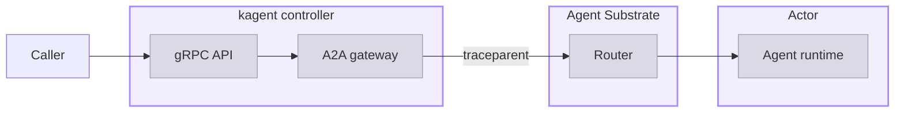

A trace records one agent request as a tree of timed spans, so you can see where a slow or failed request spent its time and which model and tool calls it made along the way. In  1.0 a single request crosses the controller, the Agent Substrate router, and the Actor that runs the agent, and one trace ties all three together.

## About trace coverage

A trace follows a W3C Trace Context header that the controller passes along with each request. The following diagram traces one request from the caller to the agent runtime.
</br></br>



A caller reaches the gRPC API on the kagent controller, which starts the trace. The controller hands the request to its A2A gateway, which opens an A2A (Agent-to-Agent) connection to the AgentInstance's Actor and injects a `traceparent` header into that call. The Agent Substrate router forwards the call to the Worker that runs the Actor, and adds its own spans to the trace. The agent runtime inside the Actor reads the header and continues the same trace, so the model and tool spans it produces hang off the controller's spans rather than starting a trace of their own.

> [!IMPORTANT]
> The controller passes its tracing configuration to the `kagent`, `codex`, and `claude` runtimes. Each of the three exports on its own instrumentation, so the span names in this page describe the `kagent` runtime and do not carry over to the other two. An agent on the `byo` runtime receives no tracing configuration, and its half of the trace is missing. For the available runtimes, see [Choose a runtime]().

> [!NOTE]
> A `byo` image that implements OTel itself reads the exporter variables from the Harness `spec.env`, which the controller leaves alone for this runtime. Its spans still do not reach a collector inside the cluster, because kagent adds the collector to an Actor's egress allowlist only for the runtimes it configures, and no field adds a host to that list by hand. For more information, see [Networking and egress control]().

Each hop reports itself as a separate OpenTelemetry (OTel) service. A tracing backend uses these service names to group the spans.

- **The controller** reports as `kagent-controller` in the `kagent` service namespace. Its spans also carry the pod, node, and namespace that the controller runs on.
- **The Agent Substrate router** reports as `agentgateway`, the proxy that the router runs.
- **Each agent runtime** reports as its own service, named for the AgentTemplate and Harness pair it was compiled from. The `my-first-agent` template on the `my-first-harness` Harness reports as `my-first-agent-my-first-harness`.

> [!NOTE]
> A service per template and Harness pair is a change from kagent 0.x, where every agent reported under one `kagent` service. A backend that you filter by service now shows one entry for each pair, and adding an agent adds a service.

### Spans

The `kagent` runtime creates the same spans for every agent, and most span names describe the operation rather than the agent. The `invoke_agent` span is the exception, because its name carries the service name of the agent that ran. To narrow a search to one agent, filter by service name rather than by span name. The following spans appear in nesting order, from the span that accepts the request down to the model and tool calls that serve it.

| Span | When it is created |
| ---- | ------------------ |
| `POST /lf.a2a.v1.A2AService/SendMessage` | Once per request, as the root of the runtime's half of the trace. The runtime creates it when it accepts the A2A call from the controller. |
| `a2a.request` | Once per request. Records the A2A method and the final state of the task in the `a2a.method` and `a2a.task.state` attributes. |
| `invocation` | Once per request, as the parent of the agent's own work. |
| `invoke_agent <agent>` | Once per request, named for the AgentTemplate and Harness pair that serves it. Unlike the service name, the span name replaces hyphens with underscores, such as `invoke_agent my_first_agent_my_first_harness`. |
| `generate_content <model>` | Once per model call, named for the model that was called. |
| `execute_tool <tool>` | Once per tool call, named for the tool that was called. |
| `execute_tool (merged)` | Once per model turn that calls more than one tool, as the parent of that turn's `execute_tool` spans. A turn that calls a single tool creates no merged span. |

### Correlation attributes

A trace tells you which request you are looking at through attributes on its spans, not through the span names. The runtime stamps the following four attributes onto its root span and copies them onto every descendant span. A search on any one of these attributes returns the whole subtree rather than a single span.

| Attribute | Value |
| --------- | ----- |
| `gen_ai.task.id` | The A2A task ID, which identifies one turn of a conversation. |
| `gen_ai.conversation.id` | The A2A context ID, which identifies the conversation and is stable across its turns. |
| `kagent.app_name` | The AgentTemplate, as `<namespace>__NS__<name>` with hyphens replaced by underscores. |
| `kagent.user_id` | The authenticated caller, or `A2A_USER_<context-id>` for an unauthenticated one. |

The runtime also adds each scalar value in the A2A message's metadata as an `a2a.message.metadata.<key>` attribute, so a client can tag a request and search for it later. Unlike the four correlation attributes, these tags stay on the `invocation` span alone, so a search on one returns that span instead of the whole subtree.

> [!WARNING]
> When the `otel.captureSensitiveContent` Helm setting is `true`, prompts and replies reach your tracing backend. The spans for a model call then carry the full serialized request and response as the `gcp.vertex.agent.llm_request` and `gcp.vertex.agent.llm_response` attributes, truncated to a prefix when a payload is larger than 32 KiB. The setting defaults to `false`, which leaves both attributes as `{}`. For how the setting applies to each runtime, see the agent harness [telemetry content settings]().

## Before you begin

1. [Install kagent]().
2. [Create your first agent](), so that you have an AgentInstance to send a request to.
3. Set up a tracing backend. The [OTel stack]() sends traces to Tempo, and the [Lightweight OTel stack]() sends traces to Jaeger. Both guides turn on tracing for you, so you can skip to [Review a trace](#review-a-trace).

## Enable tracing

Tracing is off by default. Turning it on is a Helm change, because the controller reads its tracing configuration from the environment and passes it to the agent runtimes it starts. The following steps send traces to the collector that both stack guides install. To send traces to another OTLP backend, change the endpoint.

1. Save the current revision of your Harness and AgentTemplate pair. A later step uses it to tell when kagent recompiles the pair with the new settings. The command first waits for any recompile that is still in progress, such as one from an earlier Helm upgrade, so that it saves a finished revision.
   ```bash
   for i in $(seq 1 60); do
     REVISIONS=$(kubectl get agenttemplate my-first-agent -n kagent \
       -o jsonpath='{.status.harnesses[0].desiredRevision} {.status.harnesses[0].latestSuccessfulRevision}')
     [ "${REVISIONS% *}" = "${REVISIONS#* }" ] && break
     sleep 5
   done
   export OLD_REVISION=${REVISIONS#* }
   echo "Current revision: $OLD_REVISION"
   ```

2. Get your current Helm values for kagent.
   ```shell
   helm get values kagent -n kagent -o yaml > values.yaml
   ```

3. Add the tracing settings to the values file.
   ```yaml
   otel:
     tracing:
       enabled: true
       exporter:
         otlp:
           endpoint: http://otel-collector.telemetry.svc.cluster.local:4317
           protocol: grpc
           timeout: 15000
           insecure: true
   ```

   

   | Field | Description |
   | ----- | ----------- |
   | `enabled` | Whether to export traces at all. Defaults to `false`. |
   | `exporter.otlp.endpoint` | The OTLP endpoint to export to. Empty by default, which leaves the exporter on the OTel default of `localhost:4317`. |
   | `exporter.otlp.protocol` | `grpc` or `http/protobuf`. Defaults to `grpc`, which matches the port `4317` in the example endpoint. Point `http/protobuf` at port `4318` instead. |
   | `exporter.otlp.timeout` | The export timeout in milliseconds. Defaults to `15000`. |
   | `exporter.otlp.insecure` | Whether to skip Transport Layer Security (TLS) for the exporter connection. Defaults to `true`. |

4. Upgrade the kagent Helm release.
   ```bash
   helm upgrade kagent \
     / \
     --version  \
     --namespace kagent \
     --values values.yaml
   ```

5. Wait for kagent to recompile the pair. The controller rebuilds each pair after it restarts, and an AgentInstance that you create before the rebuild finishes starts from the previous revision, without the new settings. The following command prints `Recompiled` when the new revision is ready.
   ```bash
   for i in $(seq 1 60); do
     [ "$(kubectl get agenttemplate my-first-agent -n kagent \
       -o jsonpath='{.status.harnesses[0].latestSuccessfulRevision}')" != "$OLD_REVISION" ] \
       && echo "Recompiled" && break
     sleep 5
   done
   ```
   If the command finishes without printing `Recompiled`, the upgrade did not change the pair, for example because the settings were already in place.

6. Create a new AgentInstance, so that its Actor starts from a runtime that has the tracing configuration.
   ```bash
   kagent create agent-instance --harness my-first-harness --agent-template my-first-agent
   ```

7. Confirm that the AgentInstance runs the current revision of the pair. The command waits until kagent finishes compiling the pair, then compares that revision with the one that the AgentInstance started from. If the command prints `Outdated`, the AgentInstance was created from an earlier revision, and exports without the new settings. Create another AgentInstance, and run the command again.
   ```bash
   for i in $(seq 1 60); do
     REVISIONS=$(kubectl get agenttemplate my-first-agent -n kagent \
       -o jsonpath='{.status.harnesses[0].desiredRevision} {.status.harnesses[0].latestSuccessfulRevision}')
     [ "${REVISIONS% *}" = "${REVISIONS#* }" ] && break
     sleep 5
   done
   INSTANCE_REVISION=$(kagent get agent-instance -o json \
     | jq -r '[.agentInstances[] | select(.agentTemplate.name == "my-first-agent")] | sort_by(.createdAt) | last | .preparedRevision')
   [ "$INSTANCE_REVISION" = "${REVISIONS#* }" ] && echo "Current" || echo "Outdated"
   ```

## Review a trace

1. Send a request to the AgentInstance to produce a trace.
   ```bash
   export INSTANCE_ID=$(kagent get agent-instance -o json \
     | jq -r '[.agentInstances[] | select(.agentTemplate.name == "my-first-agent")] | sort_by(.createdAt) | last | .id')
   kagent invoke --agent-instance $INSTANCE_ID --task "What is 2+2?"
   ```

2. Open the trace in your tracing backend.
   
   {}
   1. Forward the Grafana port, and leave the command running.
      ```bash
      kubectl port-forward -n telemetry svc/kube-prometheus-stack-grafana 3000:80
      ```
   2. In your browser, open Grafana at [http://localhost:3000](http://localhost:3000), and log in. For the password, see [Explore the telemetry in Grafana]().
   3. Open **Explore**, select the **Tempo** data source, and select the **Search** query type.
   4. From the **Service Name** list, select `my-first-agent-my-first-harness`, and run the query. Selecting `kagent-controller` instead returns the same traces from the controller's side.
   5. Click a trace to open it.
   {}
   {}
   1. Forward the Jaeger query port, and leave the command running.
      ```bash
      kubectl port-forward -n telemetry svc/jaeger 16686:16686
      ```
   2. In your browser, open Jaeger at [http://localhost:16686](http://localhost:16686).
   3. From the **Service** list, select `my-first-agent-my-first-harness`. Selecting `kagent-controller` instead returns the same traces from the controller's side.
   4. Leave **Operation** on `all`, or select `invocation` to start from the agent's own work rather than from the A2A call that carries it, and click **Find Traces**.
   5. Click a trace to open it.
   {}
   

3. Review the span tree. The trace starts with the controller's spans, continues through the Agent Substrate router, and ends with the agent runtime's spans. The following example shows the spans of one request, with the service that reported each span.
   ```console
   lf.a2a.v1.A2AService/SendMessage                         kagent-controller
     lf.a2a.v1.A2AService/SendMessage                       kagent-controller
       POST /*                                              agentgateway
         POST                                               agentgateway
           POST /lf.a2a.v1.A2AService/SendMessage           my-first-agent-my-first-harness
             a2a.request                                    my-first-agent-my-first-harness
               invocation                                   my-first-agent-my-first-harness
                 invoke_agent my_first_agent_my_first_harness   my-first-agent-my-first-harness
                   generate_content gpt-4.1-mini            my-first-agent-my-first-harness
                     HTTP POST                              my-first-agent-my-first-harness
   ```

4. To narrow a search to one conversation, search by a correlation attribute, such as `gen_ai.conversation.id=<context-id>`.

## Agent Substrate traces

Agent Substrate records traces for its own work, such as scheduling an Actor onto a Worker and restoring it from a snapshot. These traces are separate from the agent request trace. They do not share its trace ID, so a request trace does not show how long the Actor took to resume. To investigate a slow start, look up the Agent Substrate traces from the same time window.

| Service | Reports |
| ------- | ------- |
| `atenet-router` | Requests that the router receives, and its calls to `ateapi` to find or resume the Actor for each request. |
| `ateapi` | Actor lifecycle operations, such as create, resume, and suspend, and the scheduling of Actors onto Workers. |
| `atelet` | Work on a Worker's node, such as restoring an Actor from a snapshot. |
| `ateom-gvisor` | Work inside the sandbox that runs the Actor. |
| `atecontroller` | Reconciliation of Agent Substrate resources, such as WorkerPools. |

Agent Substrate exports traces only when its Helm release sets `otel.endpoint`, and it keeps 1% of its traces by default. To keep more, raise `otel.traces.samplingRatio`, as the stack guides do. For the steps, see [Send Agent Substrate telemetry to the collector]().

## Traces from a suspended Actor

Agent Substrate checkpoints an Actor as soon as the response body closes, which is sooner than a batching span exporter normally sends its buffer. Spans still in the buffer at that moment freeze inside the snapshot and reach the backend only when the session next resumes, or never at all for a conversation's last message.

To avoid losing them, the controller sets `KAGENT_PRE_RESPONSE_TRACE_FLUSH` to `true` on the `kagent` and `codex` runtimes, and the runtime flushes its span buffer before each response completes. The flush waits up to three seconds, which you can change with `KAGENT_TRACE_FLUSH_TIMEOUT_MS` in the Harness `spec.env`. The `claude` runtime gets no such flush, so its spans arrive on its exporter's own schedule and a conversation's last turn can lose them.

This behavior allows a kagent trace to arrive promptly rather than on the exporter's own schedule. To understand what suspension does to an Actor, see [Suspend and resume]().

## Turn tracing off

1. Disable tracing in the kagent Helm release.
   ```bash
   helm upgrade kagent \
     / \
     --version  \
     --namespace kagent --reuse-values \
     --set otel.tracing.enabled=false
   ```

2. Create a new AgentInstance to pick up the change, because an existing Actor keeps the configuration it started with.

3. To remove the tracing backend, follow the cleanup steps in the [OTel stack]() or [Lightweight OTel stack]() guide.

## Next steps


  ` title="Metrics" subtitle="Review the metrics that kagent and Agent Substrate report." >}}
  ` title="Suspend and resume" subtitle="Learn what happens to an Actor between the turns of a conversation." >}}

