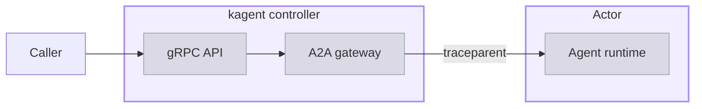

A trace records one agent request as a tree of timed spans, so you can see where a slow or failed request spent its time and which model and tool calls it made along the way. In kagent 1.0 a single request crosses two processes, the controller and the Actor that runs the agent, and a trace ties both halves together.

## About trace coverage

Tracing spans two processes, and the link between them is a W3C Trace Context header that the controller passes to the Actor. The following diagram traces one request through both.
</br></br>



A caller reaches the gRPC API on the kagent controller, which starts the trace. The controller hands the request to its A2A gateway, which opens an A2A (Agent-to-Agent) connection to the AgentInstance's Actor and injects a `traceparent` header into that call. The agent runtime inside the Actor reads the header and continues the same trace, so the model and tool spans it produces hang off the controller's spans rather than starting a trace of their own.

> [!IMPORTANT]
> The controller passes its tracing configuration only to the `kagent` runtime. An agent on the `codex`, `claude`, or `byo` runtime produces no runtime spans, and its half of the trace is missing. For a `byo` image that implements OTel itself, set the exporter variables in the Harness `spec.env` instead. For the available runtimes, see [Choose a runtime]().

Both processes report themselves as separate OpenTelemetry (OTel) services. A tracing backend uses these service names to group the spans.

- **The controller** reports as `kagent-controller` in the `kagent` service namespace. Its spans also carry the pod, node, and namespace that the controller runs on.
- **Each agent runtime** reports as its own service, named for the AgentTemplate and Harness pair it was compiled from, with hyphens replaced by underscores. The `my-first-agent` template on the `my-first-harness` Harness reports as `my_first_agent_my_first_harness`.

> [!NOTE]
> A service per template and Harness pair is a change from kagent 0.x, where every agent reported under one `kagent` service. A backend that you filter by service now shows one entry for each pair, and adding an agent adds a service.

### Spans

The agent runtime creates the same spans for every agent, and most span names describe the operation rather than the agent. The `invoke_agent` span is the exception, because its name carries the service name of the agent that ran. To narrow a search to one agent, filter by service name rather than by span name. The following spans appear in nesting order, from the span that accepts the request down to the model and tool calls that serve it.

| Span | When it is created |
| ---- | ------------------ |
| `POST /lf.a2a.v1.A2AService/SendMessage` | Once per request, as the root of the runtime's half of the trace. The runtime creates it when it accepts the A2A call from the controller. |
| `invocation` | Once per request, as the parent of the agent's own work. |
| `invoke_agent <agent>` | Once per request, named for the AgentTemplate and Harness pair that serves it. |
| `generate_content <model>` | Once per model call, named for the model that was called. |
| `execute_tool <tool>` | Once per tool call, named for the tool that was called. |
| `execute_tool (merged)` | Once per model turn that calls more than one tool, as the parent of that turn's `execute_tool` spans. A turn that calls a single tool creates no merged span. |

### Correlation attributes

A trace tells you which request you are looking at through attributes on its spans, not through the span names. The runtime stamps the following four attributes onto its root span and copies them onto every descendant span. A search on any one of these attributes returns the whole subtree rather than a single span.

| Attribute | Value |
| --------- | ----- |
| `gen_ai.task.id` | The A2A task ID, which identifies one turn of a conversation. |
| `gen_ai.conversation.id` | The A2A context ID, which identifies the conversation and is stable across its turns. |
| `kagent.app_name` | The AgentTemplate, as `<namespace>__NS__<name>` with hyphens replaced by underscores. |
| `kagent.user_id` | The authenticated caller, or `A2A_USER_<context-id>` for an unauthenticated one. |

The runtime also adds each scalar value in the A2A message's metadata as an `a2a.message.metadata.<key>` attribute, so a client can tag a request and search for it later. Unlike the four correlation attributes, these tags stay on the `invocation` span alone, so a search on one returns that span instead of the whole subtree.

> [!WARNING]
> Spans for a model call carry the full serialized request and response as the `gcp.vertex.agent.llm_request` and `gcp.vertex.agent.llm_response` attributes. Prompts and replies therefore reach your tracing backend. Payloads larger than 32 KiB are truncated to a prefix. To keep this content out of traces, set `OTEL_INSTRUMENTATION_GENAI_CAPTURE_MESSAGE_CONTENT` to `false` in the Harness `spec.env`. Note that the same variable has the opposite default for audit logging, where content is withheld until you set it to `true`. For more information, see [Audit prompts]().

## Before you begin

1. [Install kagent]().
2. [Create your first agent](), so that you have an AgentInstance to send a request to.

## Install Jaeger

Install a backend that accepts OpenTelemetry Protocol (OTLP) traces. The following steps install [Jaeger](https://www.jaegertracing.io/) in all-in-one mode, which stores traces in memory and needs no other components.

1. Create a `jaeger.yaml` configuration file.
   ```yaml
   cat << 'EOF' > jaeger.yaml
   provisionDataStore:
     cassandra: false
   allInOne:
     enabled: true
   storage:
     type: memory
   agent:
     enabled: false
   collector:
     enabled: false
   query:
     enabled: false
   EOF
   ```

2. Install Jaeger.
   ```bash
   helm repo add jaegertracing https://jaegertracing.github.io/helm-charts
   helm repo update
   helm upgrade --install jaeger jaegertracing/jaeger \
     --namespace jaeger --create-namespace \
     --history-max 3 \
     --values jaeger.yaml \
     --version 
   ```

## Enable tracing

Tracing is off by default. Turning it on is a Helm change, because the controller reads its tracing configuration from the environment and passes it to the agent runtimes it starts.

1. Get your current Helm values for kagent.
   ```shell
   helm get values kagent -n kagent -o yaml > values.yaml
   ```

2. Add the tracing settings to the values file, pointing the exporter at Jaeger.
   ```yaml
   otel:
     tracing:
       enabled: true
       exporter:
         otlp:
           endpoint: http://jaeger.jaeger.svc.cluster.local:4317
           protocol: grpc
           timeout: 15000
           insecure: true
   ```

   

   | Field | Description |
   | ----- | ----------- |
   | `enabled` | Whether to export traces at all. Defaults to `false`. |
   | `exporter.otlp.endpoint` | The OTLP endpoint to export to. Empty by default, which leaves the exporter on the OTel default of `localhost:4317`. |
   | `exporter.otlp.protocol` | `grpc` or `http/protobuf`. Defaults to `grpc`, which matches the port `4317` in the example endpoint. Point `http/protobuf` at port `4318` instead. |
   | `exporter.otlp.timeout` | The export timeout in milliseconds. Defaults to `15000`. |
   | `exporter.otlp.insecure` | Whether to skip Transport Layer Security (TLS) for the exporter connection. Defaults to `true`. |

3. Upgrade the kagent Helm release.
   ```bash
   helm upgrade kagent \
     oci://ghcr.io/kagent-dev/kagent/helm/kagent \
     --version  \
     --namespace kagent \
     --values values.yaml
   ```

4. Create a new AgentInstance, so that its Actor starts from a runtime that has the tracing configuration.
   ```bash
   kagent create agent-instance --harness my-first-harness --agent-template my-first-agent
   ```

## Review a trace

1. Send a request to the AgentInstance to produce a trace.
   ```bash
   export INSTANCE_ID=$(kagent get agent-instance -o json \
     | jq -r '[.agentInstances[] | select(.agentTemplate.name == "my-first-agent")] | sort_by(.createdAt) | last | .id')
   kagent invoke --agent-instance $INSTANCE_ID --task "What is 2+2?"
   ```

2. Forward the Jaeger query port, and leave the command running.
   ```bash
   kubectl port-forward -n jaeger svc/jaeger 16686:16686
   ```

3. In your browser, open the Jaeger user interface at [http://localhost:16686](http://localhost:16686).

4. From the **Service** dropdown, select `my_first_agent_my_first_harness`, the service that the AgentTemplate and Harness pair reports as. Selecting `kagent-controller` instead returns the same traces from the controller's side.

5. Leave **Operation** on `all`, or select `invocation` to start from the agent's own work rather than from the A2A call that carries it, and click **Find Traces**.

6. Click a trace to open it. The span tree shows the controller's gRPC and gateway spans, followed by the runtime's `POST /lf.a2a.v1.A2AService/SendMessage` span, and finally the `invocation`, `invoke_agent`, `generate_content`, and `execute_tool` spans.

7. To narrow a search to one conversation, put a correlation attribute in the **Tags** field, such as `gen_ai.conversation.id=<context-id>`.

## Traces from a suspended Actor

Agent Substrate checkpoints an Actor as soon as the response body closes, which is sooner than a batching span exporter normally sends its buffer. Spans still in the buffer at that moment freeze inside the snapshot and reach the backend only when the session next resumes, or never at all for a conversation's last message.

To avoid losing them, the controller sets `KAGENT_PRE_RESPONSE_TRACE_FLUSH` to `true` on every agent runtime it starts, and the runtime flushes its span buffer before each response completes. The flush waits up to three seconds, which you can change with `KAGENT_TRACE_FLUSH_TIMEOUT_MS` in the Harness `spec.env`.

This behavior allows a kagent trace to arrive promptly rather than on the exporter's own schedule. To understand what suspension does to an Actor, see [Suspend and resume]().

## Turn tracing off

1. Disable tracing in the kagent Helm release.
   ```bash
   helm upgrade kagent \
     oci://ghcr.io/kagent-dev/kagent/helm/kagent \
     --version  \
     --namespace kagent --reuse-values \
     --set otel.tracing.enabled=false
   ```

2. Create a new AgentInstance to pick up the change, because an existing Actor keeps the configuration it started with.

3. Remove Jaeger.
   ```bash
   helm uninstall jaeger -n jaeger
   kubectl delete namespace jaeger
   ```

## Next steps


  ` title="Audit prompts" subtitle="Export every prompt and reply as a log event for security and compliance review." >}}
  ` title="Suspend and resume" subtitle="Learn what happens to an Actor between the turns of a conversation." >}}

