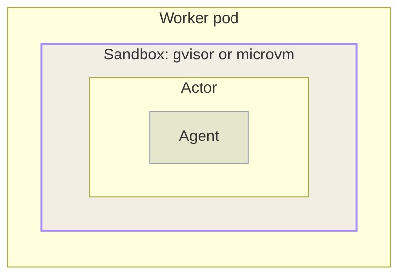

An agent is a program that decides at run time what to do next. It runs the commands that a model asks for, and it calls the tools it can access. [Agent Substrate]() runs each agent inside an **Actor**, its own unit of compute, and it does not run that Actor as an ordinary container process. Each Actor runs inside its own **sandbox**, on a Worker that hosts one Actor at a time. This page explains what selects a sandbox, what the sandbox separates, and how traffic reaches an Actor through it.
</br></br>



## Sandbox classes

A **sandbox class** is the sandbox runtime family that a Worker uses. Agent Substrate supports two.

- **`gvisor`** (default): Runs the workload against a [gVisor](https://gvisor.dev) user-space kernel, which keeps the workload's system calls from reaching the host kernel.
- **`microvm`**: Runs the workload inside a lightweight virtual machine, which places a hypervisor boundary between the workload and the host.

A WorkerPool selects its class through the `sandboxClass` field, which defaults to `gvisor`. The choice is not only a runtime preference. It also shapes the Worker pods that Agent Substrate creates for that pool, including the virtualization device mounts and node placement that a micro-VM needs.

> [!NOTE]
> kagent generates ActorTemplates that use the `gvisor` class. Keep a WorkerPool that backs kagent Harnesses on `gvisor`.

## Sandbox configuration

A **SandboxConfig** is a cluster-scoped resource that holds the material needed to start one sandbox runtime family. It carries the runtime assets that the node agent fetches, keyed by processor architecture, along with the pause image that holds the sandbox's namespaces as its root container. Each ActorTemplate names the configuration that it uses, and the name is required. Agent Substrate resolves no cluster default, so the configuration that a template names must exist before that template can be prepared.

Defining these assets in a cluster resource lets one configuration pin a runtime version for many ActorTemplates at once, rather than each template carrying its own copy.

A default installation creates a single `gvisor-default` configuration, and kagent names exactly that configuration on every ActorTemplate that it generates. The configuration looks like the following:

```yaml
apiVersion: ate.dev/v1alpha1
kind: SandboxConfig
metadata:
  name: gvisor-default
spec:
  sandboxClass: gvisor
  pauseImage: registry.k8s.io/pause:3.10.2@sha256:<digest>
  assets:
    amd64:
      gvisor:
        url: gs://gvisor/releases/release/20260803/x86_64/gvisor.tar.bz2
        sha256: <sha256>
    arm64:
      gvisor:
        url: gs://gvisor/releases/release/20260803/aarch64/gvisor.tar.bz2
        sha256: <sha256>
```

| Field | Description |
| ----- | ----------- |
| `sandboxClass` | The sandbox runtime family that this configuration applies to, `gvisor` or `microvm`. An ActorTemplate only uses configurations whose class matches its own, and preparation fails if the two disagree. |
| `pauseImage` | The image for the root sandbox container, which holds the sandbox's namespaces and runs no workload code. It must be pinned to a digest, because the snapshot manifest records it, and changing the image invalidates the snapshots that were taken with it. |
| `assets` | The files that the node agent fetches, keyed first by processor architecture and then by asset name. A `gvisor` class expects one `gvisor` asset, the release archive that the node agent extracts. A `microvm` class expects several, such as `cloud-hypervisor`, `kata-kernel`, and `kata-image`. |
| `assets.<arch>.<name>.sha256` | The lowercase hex digest of the file. The node agent verifies each download against it, and caches the result under a path that includes the digest, so changing the digest fetches the new asset instead of reusing the cached one. To read the configuration that your own cluster installed, including the pinned digests, run `kubectl get sandboxconfig gvisor-default -o yaml`.|

## What the sandbox separates

The sandbox draws a boundary in three places.

- **Process and kernel**: The Actor's processes run against the sandbox runtime rather than the Worker node's kernel. A system call that the workload makes is handled by gVisor's user-space kernel, or by the guest kernel inside a micro-VM, instead of reaching the host directly.
- **Filesystem**: The Actor sees the filesystem assembled from its container image, plus whatever durable volume its ActorTemplate declares. Writes to the root filesystem are a layer on top of the image, captured in a `Full` snapshot and discarded by a `Data` one. For what each scope keeps, see [Suspend and resume]().
- **Network**: The Actor does not share the Worker pod's network position. The node agent gives the active Actor a private, point-to-point virtual network inside the Worker pod, so reaching the Actor means going through Agent Substrate's own network path rather than connecting to the Worker directly.

## How traffic reaches a sandboxed Actor

Every Actor is addressed by its atespace and name, at `<actor-name>.<atespace>.actors.resources.substrate.ate.dev`. Reaching it involves several hops, and each one keeps a sandboxed Actor addressable without exposing the Worker that it happens to be running on.

1. Agent Substrate runs its own Domain Name System (DNS) service that answers queries for that address pattern with the address of the router, rather than any individual Worker.
2. The router reads the Actor name and atespace from the request, asks the Agent Substrate API to resume that Actor and report which Worker it is now assigned to, then selects that Worker as the destination.
3. The router connects to a listener on the Worker over mutual Transport Layer Security (mTLS). The listener validates that the caller is the router, and forwards traffic only to the Actor currently assigned to that Worker.

Because the router resolves the Worker assignment on every request, an Actor keeps a stable address across suspends, resumes, and moves between Workers.

Traffic in the other direction leaves through a separate egress gateway rather than going straight out from the Worker. Routing Actor egress through one gateway provides a single place to apply outbound controls.

## Default network posture

Agent Substrate creates a Kubernetes NetworkPolicy for each WorkerPool, selecting that pool's Worker pods. The policy restricts **ingress** to the Agent Substrate router alone. No other pod in the cluster can open a connection to a Worker, so an Actor is not reachable by anything that bypasses the routing path.

That policy governs inbound traffic only. It does not constrain what an Actor may reach outbound, so outbound access is whatever the surrounding cluster and its infrastructure already allow. Treat network egress as something to configure deliberately for your environment rather than as something the WorkerPool policy settles.
