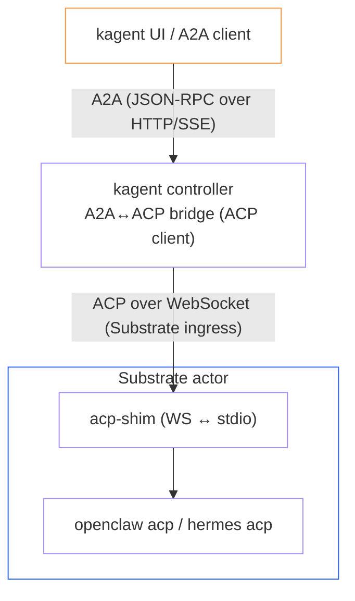

An `AgentHarness` is a Kubernetes custom resource that asks kagent to provision a long-running remote execution environment on [Agent Substrate](/docs/kagent/concepts/agent-substrate). It is useful when you want a managed sandbox that runs a coding agent (such as OpenClaw or Hermes) that you can chat with and connect to messaging channels, but you do not want kagent to package and run a full agent runtime inside the workload.

`AgentHarness` resources appear alongside agents in kagent APIs and status views, but they are not the same thing as `Agent` or `SandboxAgent`.

## How it differs from agents

- `Agent` runs a kagent-managed agent runtime, such as a declarative agent or a bring-your-own container.
- `SandboxAgent` runs a (Go) declarative agent runtime inside a sandboxed Agent Substrate actor.
- `AgentHarness` provisions the execution environment itself and runs a third-party coding agent inside it. The selected backend decides what is installed and how the environment is bootstrapped.

Think of `AgentHarness` as lifecycle management for a remote coding-agent sandbox. It gives kagent a Kubernetes-native handle for creating, tracking, deleting, and surfacing that environment, plus a standard chat surface to interact with it.

## Backend model

The `spec.backend` field selects the backend implementation.

| Backend | Purpose |
| --- | --- |
| `openclaw` | Provisions an OpenClaw-compatible sandbox and writes OpenClaw configuration when a `ModelConfig` is referenced. |
| `hermes` | Provisions a Hermes sandbox and writes Hermes configuration plus environment files for supported messaging channels. |

All backends use the same top-level `AgentHarness` shape: `backend`, `substrate`, `description`, `image`, `env`, `modelConfigRef`, and `channels`.

## Runtime: Agent Substrate

Every `AgentHarness` runs on [Agent Substrate](/docs/kagent/concepts/agent-substrate). The `spec.substrate` field is required and configures the Substrate provisioning stack:

- `workerPoolRef` — references an existing `WorkerPool` in the harness namespace. When unset, the controller uses its configured default WorkerPool.
- `snapshotsConfig` — configures where actor memory snapshots are stored. Defaults to `gs://ate-snapshots/<namespace>/<agentharnessname>` when unset.
- `workloadImage` — overrides the default backend sandbox image used in the generated `ActorTemplate`.

When the controller reconciles an `AgentHarness`, it generates a per-harness `ActorTemplate` and waits for its golden snapshot to become Ready. A single shared actor is then created on demand from that template on the first chat connection. Every chat is multiplexed as an ACP session inside that one long-lived actor.

## Lifecycle and status

The resource reports these primary conditions:

- `Accepted` tells you whether kagent accepted the spec and could hand it to the selected backend.
- `Ready` tells you whether the harness `ActorTemplate` golden snapshot is ready. Once ready, the harness can serve chat sessions.

`.status.backendRef` records the backend and instance ID, and `.status.connection.endpoint` contains the connection hint returned by kagent.

## Chatting with a harness over ACP

kagent talks to harness backends using the [Agent Client Protocol (ACP)](https://agentclientprotocol.com/), a JSON-RPC protocol for driving coding agents. Both OpenClaw and Hermes implement ACP.

Because Substrate exposes only network ingress into actors (no SSH or exec), kagent runs an in-sandbox `acp-shim` that bridges the agent's stdio ACP server to a WebSocket endpoint. The kagent controller connects to that endpoint and exposes the harness as a regular agent in the kagent UI and API:

This means you can open a harness in the kagent UI and chat with it like any other agent — see streamed tool activity and answer tool-approval prompts — without any backend-specific UI. Tool approvals from the harness map onto kagent's human-in-the-loop flow.

## Models and images

`spec.modelConfigRef` points at a kagent `ModelConfig`. OpenClaw-compatible backends translate that model configuration into OpenClaw bootstrap config. Hermes uses the referenced model while building its Hermes configuration.

If `spec.image` is omitted, kagent uses the default sandbox base image for the selected backend. Set `spec.image` only when you have a backend-compatible custom image.

## Channels

`spec.channels` declares the external messaging platform (such as Slack) that you want to integrate with the harness. Each channel has a stable `name`, a `type`, and exactly one matching channel spec.

Slack has backend-specific settings because OpenClaw and Hermes use Slack differently:

- OpenClaw settings live under `slack.openclaw` and configure channel access, allowlisted Slack channels, and interactive replies.
- Hermes settings live under `slack.hermes` and configure allowed Slack users plus the home channel used for scheduled messages.

The API uses CEL validation to ensure Slack settings match the selected backend. A Hermes harness must use `slack.hermes`; an OpenClaw harness must use `slack.openclaw`.

## Next steps

For enabling Agent Substrate so the controller can provision harnesses, see [Enable AgentHarness support](/docs/kagent/introduction/installation#enable-agentharness-support). For complete YAML examples, including Slack token references and backend-specific Slack settings, see the [Agent Harness example](/docs/kagent/examples/agent-harness). For the generated schema, see the [API reference](/docs/kagent/resources/api-ref#agentharness).
