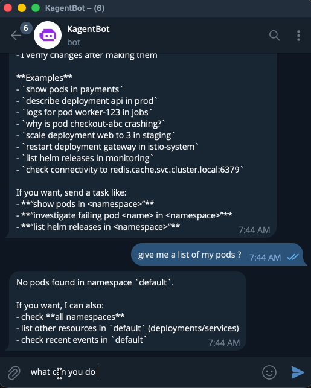
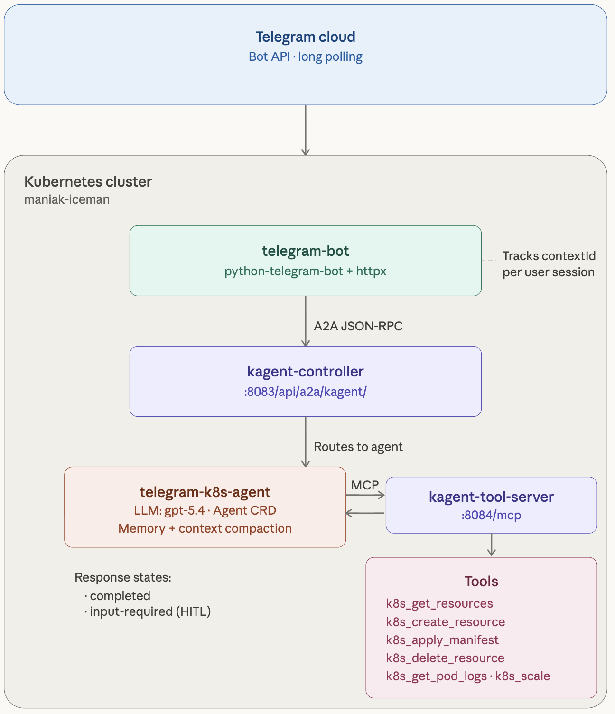

export const metadata = {
    title: "Build a Telegram Bot for Kubernetes with kagent and A2A",
    description: "Build a Telegram bot that talks to your Kubernetes cluster through kagent and A2A",
    author: "kagent.dev",
};

# Talk to Your Kubernetes Cluster from Telegram

What if you could manage your Kubernetes cluster from Telegram? Not through a half-baked webhook that runs kubectl — but through a real AI agent that understands context, uses tools, responds intelligently, and asks for your approval before doing anything destructive?

In this guide, I’ll walk you through how I built exactly that: a Telegram bot that connects to a kagent AI agent running on my home lab Kubernetes cluster (Talos Linux on Proxmox), giving me full cluster operations from my phone. The entire thing is deployed via GitOps with ArgoCD, secrets come from HashiCorp Vault, and the bot uses the A2A (Agent-to-Agent) protocol to communicate with kagent.

The bot maintains conversation continuity across messages (so the agent remembers what you were talking about), and supports Human-in-the-Loop (HITL) approval — when the agent wants to run a destructive operation like deleting a resource or applying a manifest, it shows you Approve/Reject buttons in Telegram before proceeding.

No webhooks. No public endpoints. Just polling from inside the cluster.


<div style={{ display: "flex", alignItems: "center", gap: "16px", flexWrap: "wrap" }}>
  
</div>

## Architecture Overview

Here’s what we’re building:

<div style={{ display: "flex", alignItems: "center", gap: "16px", flexWrap: "wrap" }}>
  
</div>

---

# Steps

## Step 1: Create Your Telegram Bot

1. Open Telegram, search for **@BotFather**.
2. Send `/newbot`, pick a name and username.
3. Copy the **bot token** it gives you.


---

## Step 2: Deploy a kagent Agent

> **Prerequisite:** kagent running in your cluster with `kmcp` CRDs installed. If not, hit the [quickstart](https://kagent.dev/docs/kagent/getting-started/quickstart) first.

This agent has Kubernetes tools, Helm tools, and Prometheus — and it's exposed over A2A so any client (our Telegram bot, or anything else) can talk to it. Feel free to make changes as you please:

```shell
kubectl apply -f - <<EOF
apiVersion: kagent.dev/v1alpha2
kind: Agent
metadata:
  name: telegram-k8s-agent
  namespace: kagent
spec:
  description: "Kubernetes operations agent accessible via Telegram bot"
  type: Declarative
  declarative:
    modelConfig: default-model-config
    a2aConfig:
      skills:
      - id: k8s-operations
        name: Kubernetes Operations
        description: "Query, manage, and troubleshoot Kubernetes resources"
        examples:
        - "What pods are running in the default namespace?"
        - "Show me the logs for pod X"
        - "What Helm releases are installed?"
        tags: [kubernetes, operations]
      - id: cluster-monitoring
        name: Cluster Monitoring
        description: "Query Prometheus metrics and monitor cluster health"
        examples:
        - "What is the CPU usage across nodes?"
        tags: [monitoring, prometheus]
    systemMessage: |
      You are a Kubernetes operations agent accessible via Telegram.
      Keep responses concise and well-formatted for chat readability.
    tools:
      - type: McpServer
        mcpServer:
          apiGroup: kagent.dev
          kind: RemoteMCPServer
          name: kagent-tool-server
          toolNames:
          - k8s_get_resources
          - k8s_describe_resource
          - k8s_get_pod_logs
          - k8s_get_events
          - helm_list_releases
          - helm_get_release
          - prometheus_query_tool
          - datetime_get_current_time
          requireApproval:
          - k8s_delete_resource
          - k8s_apply_manifest
          - helm_upgrade
          - helm_uninstall
EOF
```

Notice `requireApproval` — anything destructive (deleting resources, applying manifests, Helm upgrades) goes through [Human-in-the-Loop](/docs/kagent/examples/human-in-the-loop) approval in the kagent UI first. Nobody's accidentally nuking prod from a Telegram chat.

Verify it's working:

```shell
kubectl port-forward -n kagent svc/kagent-controller 8083:8083
curl localhost:8083/api/a2a/kagent/telegram-k8s-agent/.well-known/agent.json
```

You should get back JSON with the agent's name and skills.

---

## Step 3: Write the Bot

The bot is ~460 lines of Python using python-telegram-bot (polling mode) and httpx for A2A calls. It handles three main concerns: A2A communication with session continuity, HITL approval flow via Telegram inline keyboards, and robust response parsing.

* The critical detail: contextId goes inside the message object, not in params. On the first message, we omit it — kagent returns a contextId in the result. We store that per Telegram user and send it on every subsequent message. This is what makes “tell me about nginx” followed by “now scale it to 3” work as a coherent conversation.


Let’s walk through it section by section.

* A2A Communication: The core of the bot — sending messages to kagent and tracking contextId for session continuity:
* Response Parsing: kagent returns text in different locations depending on the response state. The bot tries three sources in order:
* HITL Approval Flow: When kagent returns input-required, the bot parses the adk_request_confirmation data to figure out what tool the agent wants to run, then shows Telegram inline keyboard buttons:


### requirements.txt

```
python-telegram-bot>=21.0
httpx>=0.27.0
```

### main.py

```python
"""Telegram bot that forwards messages to a kagent A2A agent."""

import logging, os, uuid
from pathlib import Path

import httpx
from telegram import Update
from telegram.ext import Application, CommandHandler, MessageHandler, filters

logging.basicConfig(level=logging.INFO)

TELEGRAM_BOT_TOKEN = os.environ["TELEGRAM_BOT_TOKEN"]
KAGENT_A2A_URL = os.environ["KAGENT_A2A_URL"]


async def send_a2a_task(message_text: str, session_id: str) -> str:
    """Send a message to the kagent A2A endpoint and return the response."""
    task_id = str(uuid.uuid4())
    payload = {
        "jsonrpc": "2.0",
        "id": task_id,
        "method": "message/send",
        "params": {
            "id": task_id,
            "message": {
                "role": "user",
                "parts": [{"kind": "text", "text": message_text}],
            },
        },
    }
    async with httpx.AsyncClient(timeout=120.0) as client:
        resp = await client.post(
            KAGENT_A2A_URL,
            json=payload,
            headers={"Content-Type": "application/json"},
        )
        resp.raise_for_status()
        data = resp.json()

    result = data.get("result", {})
    artifacts = result.get("artifacts", [])
    if artifacts:
        parts = artifacts[-1].get("parts", [])
        texts = [p.get("text", "") for p in parts if p.get("kind") == "text"]
        if texts:
            return "\n".join(texts)
    return "Agent returned no text response."


# Per-user session tracking
user_sessions: dict[int, str] = {}


def get_session(user_id: int) -> str:
    if user_id not in user_sessions:
        user_sessions[user_id] = str(uuid.uuid4())
    return user_sessions[user_id]


async def start_command(update: Update, _) -> None:
    await update.message.reply_text(
        "Hello! I'm connected to a kagent Kubernetes agent.\n\n"
        "Send me any message and I'll forward it to the agent.\n\n"
        "Commands:\n"
        "/start - Show this message\n"
        "/new - Reset your conversation session"
    )


async def new_command(update: Update, _) -> None:
    user_id = update.effective_user.id
    user_sessions[user_id] = str(uuid.uuid4())
    await update.message.reply_text("Session reset. Starting fresh conversation.")


async def handle_message(update: Update, _) -> None:
    user_id = update.effective_user.id
    session_id = get_session(user_id)
    thinking_msg = await update.message.reply_text("Thinking...")
    try:
        response = await send_a2a_task(update.message.text, session_id)
        for i in range(0, len(response), 4000):  # Telegram 4096 char limit
            chunk = response[i : i + 4000]
            if i == 0:
                await thinking_msg.edit_text(chunk)
            else:
                await update.message.reply_text(chunk)
    except Exception as e:
        await thinking_msg.edit_text(f"Error contacting agent: {e}")


def main() -> None:
    app = Application.builder().token(TELEGRAM_BOT_TOKEN).build()
    app.add_handler(CommandHandler("start", start_command))
    app.add_handler(CommandHandler("new", new_command))
    app.add_handler(MessageHandler(filters.TEXT & ~filters.COMMAND, handle_message))
    Path("/tmp/bot-healthy").touch()  # For k8s probes
    app.run_polling(drop_pending_updates=True)


if __name__ == "__main__":
    main()
```

It uses polling — no ingress, no webhooks, no TLS to set up. Each Telegram user gets their own session so conversations keep context. Long responses get chunked automatically (Telegram's 4096-char limit). The `/tmp/bot-healthy` file is there for Kubernetes liveness probes.

### Dockerfile

```dockerfile
FROM python:3.12-slim
WORKDIR /app
COPY requirements.txt .
RUN pip install --no-cache-dir -r requirements.txt
COPY main.py .
CMD ["python", "main.py"]
```

```shell
docker build -t your-registry/telegram-kagent-bot:latest .
docker push your-registry/telegram-kagent-bot:latest
```

---

## Step 4: Test It Locally

Before you deploy anything, make sure it actually works.

```shell
# Terminal 1: port-forward kagent
kubectl port-forward -n kagent svc/kagent-controller 8083:8083

# Terminal 2: run the bot
pip install -r requirements.txt
export TELEGRAM_BOT_TOKEN=your_token_from_botfather
export KAGENT_A2A_URL=http://127.0.0.1:8083/api/a2a/kagent/telegram-k8s-agent/
python main.py
```

Open Telegram, find your bot, send "What pods are running?" — if you get a real answer, you're golden.

---

## Step 5: Deploy to Kubernetes

Store the bot token:

```shell
kubectl create secret generic telegram-bot-token -n kagent \
  --from-literal=TELEGRAM_BOT_TOKEN="your_token_from_botfather"
```

<details>
<summary>Using External Secrets Operator instead?</summary>

```yaml
apiVersion: external-secrets.io/v1
kind: ExternalSecret
metadata:
  name: telegram-bot-token
  namespace: kagent
spec:
  refreshInterval: "1h"
  secretStoreRef:
    name: vault-backend
    kind: ClusterSecretStore
  target:
    name: telegram-bot-token
    creationPolicy: Owner
  data:
    - secretKey: TELEGRAM_BOT_TOKEN
      remoteRef:
        key: telegram
        property: api_key
```

</details>

Deploy the bot:

```yaml
apiVersion: apps/v1
kind: Deployment
metadata:
  name: telegram-bot
  namespace: kagent
  labels:
    app: telegram-bot
spec:
  replicas: 1
  strategy:
    type: Recreate
  selector:
    matchLabels:
      app: telegram-bot
  template:
    metadata:
      labels:
        app: telegram-bot
    spec:
      containers:
      - name: bot
        image: your-registry/telegram-kagent-bot:latest
        env:
        - name: TELEGRAM_BOT_TOKEN
          valueFrom:
            secretKeyRef:
              name: telegram-bot-token
              key: TELEGRAM_BOT_TOKEN
        - name: KAGENT_A2A_URL
          value: "http://kagent-controller.kagent.svc.cluster.local:8083/api/a2a/kagent/telegram-k8s-agent/"
        livenessProbe:
          exec:
            command: ["cat", "/tmp/bot-healthy"]
          initialDelaySeconds: 10
          periodSeconds: 30
        resources:
          requests:
            cpu: 50m
            memory: 64Mi
          limits:
            cpu: 200m
            memory: 128Mi
```

The strategy is `Recreate` on purpose — Telegram polling doesn't support multiple consumers. Two pods polling the same bot token means duplicate or missed messages.

```shell
kubectl apply -f deployment.yaml
```

---

## Take It Further

The interesting part isn't the Telegram bot — it's the pattern. The bot is just a transport layer. A2A is the interface. That means:

- **Multiple agents, one bot.** Add Telegram commands like `/k8s`, `/istio`, `/security` that route to different kagent agents.
- **Any chat platform.** Swap `python-telegram-bot` for `discord.py` or `slack-bolt`. Everything else stays the same.
- **Multi-modal.** kagent supports image parts — screenshot a Grafana dashboard and ask "what's wrong here?"
- **AgentGateway.** Put [AgentGateway](https://agentgateway.dev) in front of the A2A endpoint for rate limiting, auth, and observability.

Questions? Come find us on [Discord](https://discord.gg/Fu3k65f2k3).
