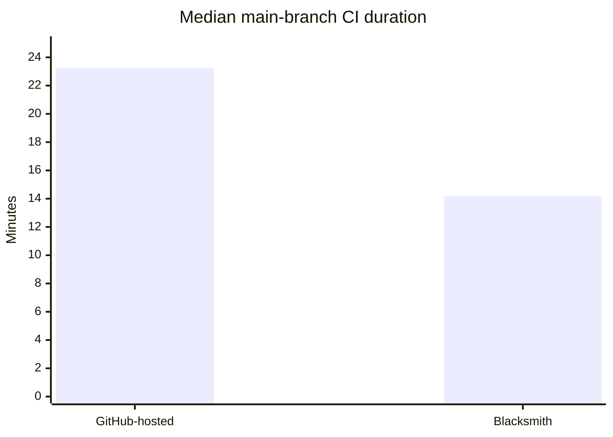
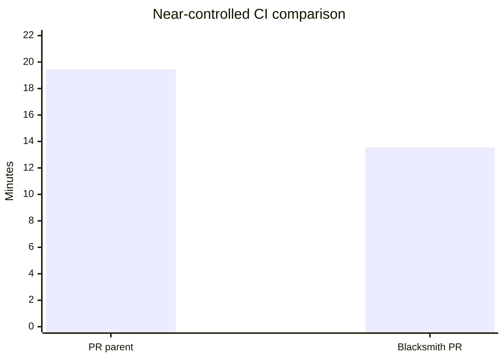
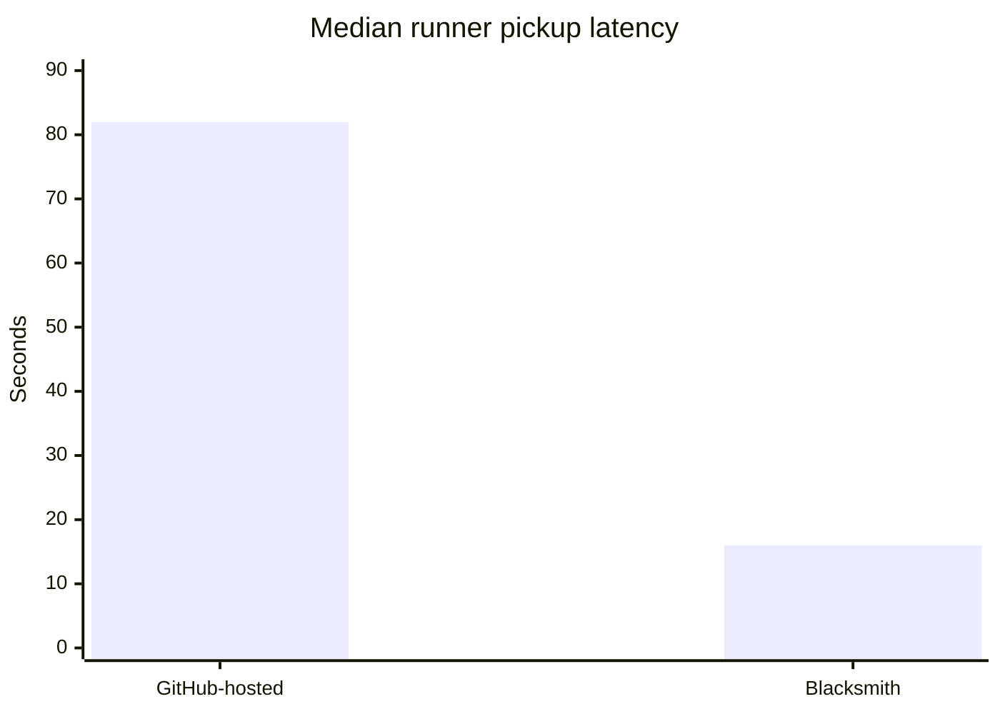

export const metadata = {
  title: "Next generation CI using Blacksmith",
  publishDate: "2026-09-04T00:00:00Z",
  description: "Life of a maintainer: How we cut our CI time by 1/3 using Blacksmith",
  author: "Eitan Yarmush",
  authorIds: ["eitanya"],
}

# We Cut Our CI Feedback Time by 39% with Blacksmith

Our CI had become maddeningly slow. The tests were only part of the problem...jobs routinely
spent another minute or two waiting for GitHub-hosted capacity.

We recently moved our critical workflows to Blacksmith in kagent PR #2659
(https://github.com/kagent-dev/kagent/pull/2659), the difference was immediate.

## The Results Speak For Themselves

Across successful main-branch runs, median CI duration dropped from 23 minutes 16 seconds to 14
minutes 10 seconds: a 39% reduction.

That gives developers feedback roughly nine minutes sooner on every change.

A near-controlled comparison—using the migration PR and its parent, which differed only in CI
configuration—showed the same result:

That run fell from 19m27s to 13m33s, a 30% reduction.

## Jobs now start when they are ready

Runner pickup was arguably the most satisfying improvement.

We measured the delay between our setup job completing and dependent build or test jobs
starting. Median pickup latency dropped from 82 seconds to 16 seconds—an 80% reduction.

Previously, our CI fan-out routinely sat idle for another one or two minutes. With Blacksmith,
those jobs generally start within seconds.

The workloads on our critical path also ran faster:

  Job                 Before    Blacksmith    Reduction
━━━━━━━━━━━━━━━━━━  ━━━━━━━━  ━━━━━━━━━━━━  ━━━━━━━━━━━
  UI tests             9m57s         7m31s        24.5%
──────────────────  ────────  ────────────  ───────────
  End-to-end tests    16m21s        12m22s        24.3%
──────────────────  ────────  ────────────  ───────────
  Runner pickup        1m22s           16s        80.5%
──────────────────  ────────  ────────────  ───────────
  Full CI             23m16s        14m10s        39.1%

## CI feels responsive again

Not every individual image build became faster—our free 2-vCPU build runners produced mixed
timings—but the critical result is clear: the feedback loop developers experience is
dramatically shorter.

Saving roughly nine minutes per run has made CI feel
useful again instead of punitive. After spending far too long watching jobs sit in a queue,
seeing the entire fan-out start in seconds is honestly delightful.

## Data and methodology

The measurements use GitHub Actions timestamps from September 1–3, 2026:

- Full-CI medians: five successful main runs before migration and eleven after.
- Pickup latency: 85 successful dependent jobs before and 110 after.
- Job duration: completed_at - started_at.
- Pickup latency: dependent job started_at - setup.completed_at.
- Controlled baseline: GitHub-hosted run
  (https://github.com/kagent-dev/kagent/actions/runs/33634657352).

- Controlled comparison: Blacksmith run
  (https://github.com/kagent-dev/kagent/actions/runs/33634940563).

- Migration: PR #2659 (https://github.com/kagent-dev/kagent/pull/2659).
